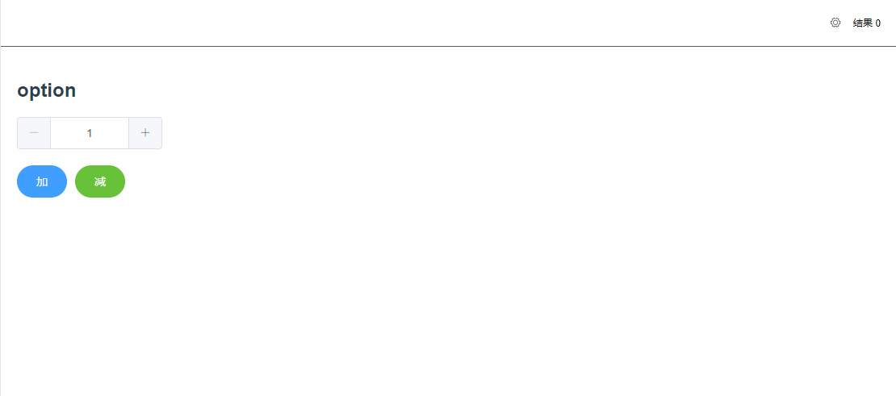
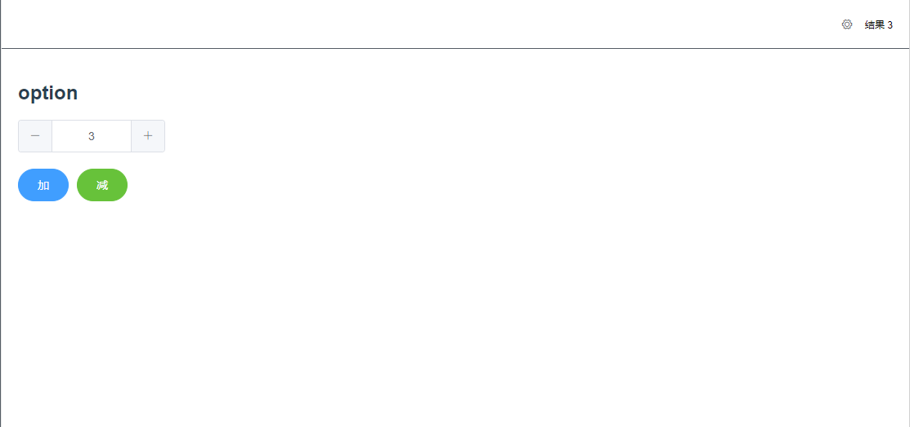

### 什么是 Vuex

来自官方的解释：Vuex 是一个专为 Vue.js 应用程序开发的状态管理模式。它采用集中式存储管理应用的所有组件的状态，并以相应的规则保证状态以一种可预测的方式发生变化。
简单来说，即 Vuex 管理了应用中所有的全局状态，我们可以在应用的任何地方通过某种方式获取或者改变这些状态。

### 为什么需要 Vuex

我们知道，在 Vue 中有一个“单项数据流”的理念，举个栗子，子组件可以接收父组件传递的参数但是不能直接修改。

假设现在有一个状态，两个兄弟组件之间都在使用，并且其中一个组件修改了这个状态之后，另一个组件也需要实时变化，如果是靠组件之间的数据传递，就显得特别复杂了。对于这种状态，我们就应该将其放在 Vuex 中。

官方场景：

- 多个视图依赖于同一状态。
- 来自不同视图的行为需要变更同一状态。

对于问题一，传参的方法对于多层嵌套的组件将会非常繁琐，并且对于兄弟组件间的状态传递无能为力。对于问题二，我们经常会采用父子组件直接引用或者通过事件来变更和同步状态的多份拷贝。以上的这些模式非常脆弱，通常会导致无法维护的代码。

<!--more-->

说了这么多，直接上手干吧！
先看一幅 Vuex 流程图


### 先来一个场景

如图

右上角有一个全局的结果 0，这个结果在 header 组件当中，当我们在页面上点击加或减时，会根据 input 框中的值计算出结果并显示

### store.js

```javascript
import Vue from 'vue';
import Vuex from 'vuex';

Vue.use(Vuex);

export default new Vuex.Store({
  state: {
    count: 0,
  },
  mutations: {
    increment(state, payload) {
      state.count += payload;
    },
  },
  actions: {
    incrementAsync({ commit }, payload) {
      return new Promise(resolve => {
        setTimeout(() => {
          commit('increment', payload);
          resolve();
        }, 1000);
      });
    },
  },
});
```

在 store.js 中，有三个核心的概念：

**state:** 它便是应用中的核心数据源，我希望当 state.count 变化的时候，右上角的结果也能随之变化

在 vue 组件中获得 state 中的状态:

```javascript
<template>
  <span class="user">结果&nbsp;</span>
  <span>{{count}}</span>
</template>
<script>
import { mapState } from "vuex";
export default {
  props: [],
  data() {
  },
  computed: { ...mapState(["count"]) }
};
</script>
```

**mutations:** 更改 Vuex 的 store 中的状态的唯一方法是提交 mutation。Vuex 中的 mutation 非常类似于事件：每个 mutation 都有一个字符串的 事件类型 (type) 和 一个 回调函数 (handler)。这个回调函数就是我们实际进行状态更改的地方(**Mutation 必须是同步函数**)

**action:** Action 类似于 mutation，不同在于：

- Action 提交的是 mutation，而不是直接变更状态。
- Action 可以包含任意异步操作。

在 action 中我们通过 commit 触发 mutations，让 mutations 来改变 state

在 vue 组件中触发 action（action 可以是异步的，如上面的代码）

```javascript
<template>
  <div class="box">
    <h2>option</h2>
    <div class="num-box">
      <el-input-number v-model="num" :min="1" :max="10"></el-input-number>
    </div>
    <el-button :loading="loading" type="primary" round @click="wait(num)">加</el-button>
    <el-button :loading="loading" type="success" round @click="wait(-num)">减</el-button>
  </div>
</template>
<script>
import { mapActions } from "vuex";
export default {
  name: "options",
  data() {
    return {
      num: 1,
      loading: false
    };
  },
  methods: {
    wait(num) {
      this.loading = true;
      this.add(num).then(() => {
        this.loading = false;
      });
    },
    ...mapActions({
      add: "incrementAsync" // 将 `this.add()` 映射为 `this.$store.dispatch('increment')`
    })
  }
};
</script>
<style lang="less" scoped>
.box {
  .num-box {
    margin-bottom: 20px;
  }
}
</style>
```

现在，当我们点击加或减的时候就能够触发对应的 action，就能让 count 改变了。并且能在页面中体现出来。


### 结束
