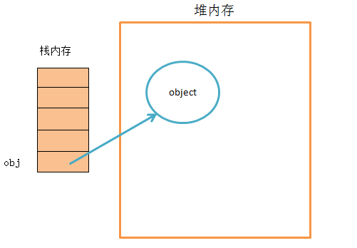

### <div align=center>前端模块化详解

---

在 JavaScript 发展初期就是为了实现简单的页面交互逻辑，寥寥数语即可；如今 CPU、浏览器性能得到了极大的提升，很多页面逻辑迁移到了客户端（表单验证等），随着 web2.0 时代的到来，Ajax 技术得到广泛应用，jQuery 等前端库层出不穷，前端代码日益膨胀，此时在 JS 方面就会考虑使用模块化规范去管理。


#### 模块化的理解

1. 什么是模块

- 将一个复杂的程序依据一定的规则(规范)封装成几个块(文件), 并进行组合在一起
- 块的内部数据与实现是私有的, 只是向外部暴露一些接口(方法)与外部其它模块通信
  <!--more-->

2. 模块化的进化过程
   - 全局 function 模式 : 将不同的功能封装成不同的全局函数
     - 编码: 将不同的功能封装成不同的全局函数
     - 问题: 污染全局命名空间, 容易引起命名冲突或数据不安全，而且模块成员之间看不出直接关系
   - namespace 模式 : 简单对象封装
     - 作用: 减少了全局变量，解决命名冲突
     - 问题: 数据不安全(外部可以直接修改模块内部的数据)
   - IIFE 模式：匿名函数自调用(闭包)
     - 作用: 数据是私有的, 外部只能通过暴露的方法操作
     - 编码: 将数据和行为封装到一个函数内部, 通过给 window 添加属性来向外暴露接口
     - 问题: 如果当前这个模块依赖另一个模块怎么办?
3. 模块化的好处

- 避免命名冲突(减少命名空间污染)
- 更好的分离, 按需加载
- 更高复用性
- 高可维护性

4. 引入多个\<script\>后出现出现问题

- 请求过多
- 依赖模糊
- 难以维护

#### 模块化规范

1.  CommonJS

    - 概述
      Node 应用由模块组成，采用 CommonJS 模块规范。每个文件就是一个模块，有自己的作用域。在一个文件里面定义的变量、函数、类，都是私有的，对其他文件不可见。在服务器端，模块的加载是运行时同步加载的；在浏览器端，模块需要提前编译打包处理。
    - 特点
      - 所有代码都运行在模块作用域，不会污染全局作用域。
      - 模块可以多次加载，但是只会在第一次加载时运行一次，然后运行结果就被缓存了，以后再加载，就直接读取缓存结果。要想让模块再次运行，必须清除缓存。
      - 模块加载的顺序，按照其在代码中出现的顺序。
    - 基本语法
      - 暴露模块：module.exports = value 或 exports.xxx = value
      - 引入模块：require(xxx),如果是第三方模块，xxx 为模块名；如果是自定义模块，xxx 为模块文件路径
        CommonJS 规范规定，每个模块内部，module 变量代表当前模块。**这个变量是一个对象**，它的 exports 属性（即 module.exports）是对外的接口。加载某个模块，其实是加载该模块的 module.exports 属性。

    ```javascript
    // example.js
    var x = 5;
    var addX = function(value) {
      return value + x;
    };
    module.exports.x = x;
    module.exports.addX = addX;

    var example = require('./example.js'); //如果参数字符串以“./”开头，则表示加载的是一个位于相对路径
    console.log(example.x); // 5
    console.log(example.addX(1)); // 6
    ```

    require 命令用于加载模块文件。require 命令的基本功能是，读入并执行一个 JavaScript 文件，然后返回该模块的 exports 对象。如果没有发现指定模块，会报错。

    - 模块的加载机制
      CommonJS 模块的加载机制是，输入的是被输出的值的拷贝。也就是说，一旦输出一个值，模块内部的变化就影响不到这个值。

2.  AMD
    CommonJS 规范加载模块是同步的，也就是说，只有加载完成，才能执行后面的操作。AMD 规范则是非同步加载模块，允许指定回调函数。由于 Node.js 主要用于服务器编程，模块文件一般都已经存在于本地硬盘，所以加载起来比较快，不用考虑非同步加载的方式，所以 CommonJS 规范比较适用。但是，如果是浏览器环境，要从服务器端加载模块，这时就必须采用非同步模式，因此浏览器端一般采用 AMD 规范。

    - AMD 规范基本语法

    ```javascript
    //定义暴露模块:
    //定义没有依赖的模块
    define(function() {
      return 模块;
    });

    //定义有依赖的模块
    define(['module1', 'module2'], function(m1, m2) {
      return 模块;
    });

    //引入使用模块:
    require(['module1', 'module2'], function(m1, m2) {
      //使用m1/m2
    });
    ```

3.  CMD
    CMD 规范专门用于浏览器端，模块的加载是异步的，模块使用时才会加载执行。CMD 规范整合了 CommonJS 和 AMD 规范的特点。在 Sea.js 中，所有 JavaScript 模块都遵循 CMD 模块定义规范。

4.  ES6 模块化
    ES6 模块的设计思想是尽量的静态化，使得编译时就能确定模块的依赖关系，以及输入和输出的变量。CommonJS 和 AMD 模块，都只能在运行时确定这些东西。比如，CommonJS 模块就是对象，输入时必须查找对象属性。

    - ES6 模块化语法
      export 命令用于规定模块的对外接口，import 命令用于输入其他模块提供的功能。
      `javascript /** 定义模块 math.js **/ var basicNum = 0; var add = function(a, b) { return a + b; }; export { basicNum, add }; /** 引用模块 **/ import { basicNum, add } from './math'; function test(ele) { ele.textContent = add(99 + basicNum); }`
      使用 import 命令的时候，用户需要知道所要加载的变量名或函数名，否则无法加载。为了给用户提供方便，让他们不用阅读文档就能加载模块，就要用到 export default 命令，为模块指定默认输出。

      ```javascript
      // export-default.js
      export default function() {
        console.log('foo');
      }

      // import-default.js
      import customName from './export-default';
      customName(); // 'foo'

      //模块默认输出, 其他模块加载该模块时，import命令可以为该匿名函数指定任意名字。
      ```

    - ES6 模块与 CommonJS 模块的差异
      - CommonJS 模块输出的是一个值的拷贝，ES6 模块输出的是值的引用。
      - CommonJS 模块是运行时加载，ES6 模块是编译时输出接口。
        第二个差异是因为 CommonJS 加载的是一个对象（即 module.exports 属性），该对象只有在脚本运行完才会生成。而 ES6 模块不是对象，它的对外接口只是一种静态定义，在代码静态解析阶段就会生成。
        ```javascript
        // lib.js
        export let counter = 3;
        export function incCounter() {
          counter++;
        }
        // main.js
        import { counter, incCounter } from './lib';
        console.log(counter); // 3
        incCounter();
        console.log(counter); // 4
        ```

#### 总结

- CommonJS 规范主要用于服务端编程，加载模块是同步的，这并不适合在浏览器环境，因为同步意味着阻塞加载，浏览器资源是异步加载的，因此有了 AMD CMD 解决方案。
- AMD 规范在浏览器环境中异步加载模块，而且可以并行加载多个模块。不过，AMD 规范开发成本高，代码的阅读和书写比较困难，模块定义方式的语义不顺畅。
- CMD 规范与 AMD 规范很相似，都用于浏览器编程，依赖就近，延迟执行，可以很容易在 Node.js 中运行。不过，依赖 SPM 打包，模块的加载逻辑偏重
- **ES6 在语言标准的层面上，实现了模块功能，而且实现得相当简单，完全可以取代 CommonJS 和 AMD 规范，成为浏览器和服务器通用的模块解决方案。**

### <div align=center>跨域方式实现原理

---

#### 什么是跨域

1. 同源策略及其限制内容
   同源策略是一种约定，它是浏览器最核心也最基本的安全功能，如果缺少了同源策略，浏览器很容易受到 XSS、CSRF 等攻击。所谓同源是指"协议+域名+端口"三者相同，即便两个不同的域名指向同一个 ip 地址，也非同源。

同源策略限制内容有：

- Cookie、LocalStorage、IndexedDB 等存储性内容
- DOM 节点
- AJAX 请求发送后，结果被浏览器拦截了

有三个标签是允许跨域加载资源：

- \
- \<link href=XXX>
- \<script src=XXX>

2. 常见跨域场景
   当协议、子域名、主域名、端口号中任意一个不相同时，都算作不同域。不同域之间相互请求资源，就算作“跨域”。

特别说明：

- 如果是协议和端口造成的跨域问题“前台”是无能为力的。
- 在跨域问题上，仅仅是通过“URL 的首部”来识别而不会根据域名对应的 IP 地址是否相同来判断。“URL 的首部”可以理解为“协议, 域名和端口必须匹配”。

#### 跨域解决方案

1. jsonp

- 原理：
  利用\<script\> 标签没有跨域限制的漏洞，网页可以得到从其他来源动态产生的 JSON 数据。JSONP 请求一定需要对方的服务器做支持才可以。

- JSONP 和 AJAX 对比：
  JSONP 和 AJAX 相同，都是客户端向服务器端发送请求，从服务器端获取数据的方式。但 AJAX 属于同源策略，JSONP 属于非同源策略（跨域请求）

- JSONP 优缺点：
  JSONP 优点是简单兼容性好，可用于解决主流浏览器的跨域数据访问的问题。缺点是仅支持 get 方法具有局限性,不安全可能会遭受 XSS 攻击。

- JSONP 的实现流程：
  - 声明一个回调函数，其函数名(如 show)当做参数值，要传递给跨域请求数据的服务器，函数形参为要获取目标数据(服务器返回的 data)。
  - 创建一个\<script\>标签，把那个跨域的 API 数据接口地址，赋值给 script 的 src,还要在这个地址中向服务器传递该函数名（可以通过问号传参:?callback=show）。
  - 服务器接收到请求后，需要进行特殊的处理：把传递进来的函数名和它需要给你的数据拼接成一个字符串,例如：传递进去的函数名是 show，它准备好的数据是 show('我不爱你')。
  - 最后服务器把准备的数据通过 HTTP 协议返回给客户端，客户端再调用执行之前声明的回调函数（show），对返回的数据进行操作。

自己封装一个 JSONP 函数

```javascript
function jsonp({ url, params, callback }) {
  return new Promise((resolve, reject) => {
    let script = document.createElement('script');
    window[callback] = function(data) {
      resolve(data);
      document.body.removeChild(script);
    };
    params = { ...params, callback }; // wd=b&callback=show
    let arrs = [];
    for (let key in params) {
      arrs.push(`${key}=${params[key]}`);
    }
    script.src = `${url}?${arrs.join('&')}`;
    document.body.appendChild(script);
  });
}
jsonp({
  url: 'http://localhost:3000/say',
  params: { wd: 'Iloveyou' },
  callback: 'show',
}).then(data => {
  console.log(data);
});
```

这段代码相当于向http://localhost:3000/say?wd=Iloveyou&callback=show这个地址请求数据，然后后台返回show('我不爱你')，最后会运行show()这个函数，打印出'我不爱你'

```javascript
// server.js
let express = require('express');
let app = express();
app.get('/say', function(req, res) {
  let { wd, callback } = req.query;
  console.log(wd); // Iloveyou
  console.log(callback); // show
  res.end(`${callback}('我不爱你')`);
});
app.listen(3000);
```

- jQuery 的 jsonp 形式

JSONP 都是 GET 和异步请求的，不存在其他的请求方式和同步请求，且 jQuery 默认就会给 JSONP 的请求清除缓存。

```javascript
$.ajax({
  url: 'http://crossdomain.com/jsonServerResponse',
  dataType: 'jsonp',
  type: 'get', //可以省略
  jsonpCallback: 'show', //->自定义传递给服务器的函数名，而不是使用jQuery自动生成的，可省略
  jsonp: 'callback', //->把传递函数名的那个形参callback，可省略
  success: function(data) {
    console.log(data);
  },
});
```

2. cors

CORS 需要浏览器和后端同时支持。IE 8 和 9 需要通过 XDomainRequest 来实现。

浏览器会自动进行 CORS 通信，实现 CORS 通信的关键是后端。只要后端实现了 CORS，就实现了跨域。

服务端设置 Access-Control-Allow-Origin 就可以开启 CORS。 该属性表示哪些域名可以访问资源，如果设置通配符则表示所有网站都可以访问资源。

虽然设置 CORS 和前端没什么关系，但是通过这种方式解决跨域问题的话，会在发送请求时出现两种情况，分别为**简单请求**和**复杂请求**。

- **简单请求**

只要同时满足以下两大条件，就属于简单请求

条件 1：使用下列方法之一：

- GET
- HEAD
- POST

条件 2：Content-Type 的值仅限于下列三者之一：

- text/plain
- multipart/form-data
- application/x-www-form-urlencoded

* **复杂请求**

不符合以上条件的请求就肯定是复杂请求了。
复杂请求的 CORS 请求，会在正式通信之前，增加一次 HTTP 查询请求，称为"预检"请求,该请求是 option 方法的，通过该请求来知道服务端是否允许跨域请求。

我们用 PUT 向后台请求时，属于复杂请求，后台需做如下配置：

```javascript
// 允许哪个方法访问我
res.setHeader('Access-Control-Allow-Methods', 'PUT');
// 预检的存活时间
res.setHeader('Access-Control-Max-Age', 6);
// OPTIONS请求不做任何处理
if (req.method === 'OPTIONS') {
  res.end();
}
// 定义后台返回的内容
app.put('/getData', function(req, res) {
  console.log(req.headers);
  res.end('我不爱你');
});
```

一个完整复杂请求的例子，并且介绍下 CORS 请求相关的字段

```javascript
// index.html
let xhr = new XMLHttpRequest();
document.cookie = 'name=xiamen'; // cookie不能跨域
xhr.withCredentials = true; // 前端设置是否带cookie
xhr.open('PUT', 'http://localhost:4000/getData', true);
xhr.setRequestHeader('name', 'xiamen');
xhr.onreadystatechange = function() {
  if (xhr.readyState === 4) {
    if ((xhr.status >= 200 && xhr.status < 300) || xhr.status === 304) {
      console.log(xhr.response);
      //得到响应头，后台需设置Access-Control-Expose-Headers
      console.log(xhr.getResponseHeader('name'));
    }
  }
};
xhr.send();

//server1.js
let express = require('express');
let app = express();
app.use(express.static(__dirname));
app.listen(3000);

//server2.js
let express = require('express');
let app = express();
let whitList = ['http://localhost:3000']; //设置白名单
app.use(function(req, res, next) {
  let origin = req.headers.origin;
  if (whitList.includes(origin)) {
    // 设置哪个源可以访问我
    res.setHeader('Access-Control-Allow-Origin', origin);
    // 允许携带哪个头访问我
    res.setHeader('Access-Control-Allow-Headers', 'name');
    // 允许哪个方法访问我
    res.setHeader('Access-Control-Allow-Methods', 'PUT');
    // 允许携带cookie
    res.setHeader('Access-Control-Allow-Credentials', true);
    // 预检的存活时间
    res.setHeader('Access-Control-Max-Age', 6);
    // 允许返回的头
    res.setHeader('Access-Control-Expose-Headers', 'name');
    if (req.method === 'OPTIONS') {
      res.end(); // OPTIONS请求不做任何处理
    }
  }
  next();
});
app.put('/getData', function(req, res) {
  console.log(req.headers);
  res.setHeader('name', 'jw'); //返回一个响应头，后台需设置
  res.end('我不爱你');
});
app.get('/getData', function(req, res) {
  console.log(req.headers);
  res.end('我不爱你');
});
app.use(express.static(__dirname));
app.listen(4000);
```

3. postMessage

postMessage 是 HTML5 XMLHttpRequest Level 2 中的 API，且是为数不多可以跨域操作的 window 属性之一，它可用于解决以下方面的问题：

- 页面和其打开的新窗口的数据传递
- 多窗口之间消息传递
- 页面与嵌套的 iframe 消息传递
- 上面三个场景的跨域数据传递

postMessage()方法允许来自不同源的脚本采用异步方式进行有限的通信，可以实现跨文本档、多窗口、跨域消息传递。

otherWindow.postMessage(message, targetOrigin, [transfer]);

4. websocket

Websocket 是 HTML5 的一个持久化的协议，它实现了浏览器与服务器的全双工通信，同时也是跨域的一种解决方案。WebSocket 和 HTTP 都是应用层协议，都基于 TCP 协议。但是 WebSocket 是一种双向通信协议，在建立连接之后，WebSocket 的 server 与 client 都能主动向对方发送或接收数据。同时，WebSocket 在建立连接时需要借助 HTTP 协议，连接建立好了之后 client 与 server 之间的双向通信就与 HTTP 无关了。

5. Node 中间件代理(两次跨域)

实现原理：同源策略是浏览器需要遵循的标准，而如果是服务器向服务器请求就无需遵循同源策略。
代理服务器，需要做以下几个步骤：

- 接受客户端请求 。
- 将请求转发给服务器。
- 拿到服务器响应数据。
- 将响应转发给客户端。

本地文件 index.html 文件，通过代理服务器http://localhost:3000向目标服务器http://localhost:4000请求数据。

```javascript
// index.html(http://127.0.0.1:5500)
<script src="https://cdn.bootcss.com/jquery/3.3.1/jquery.min.js"></script>
<script>
  $.ajax({
    url: 'http://localhost:3000',
    type: 'post',
    data: { name: 'xiamen', password: '123456' },
    contentType: 'application/json;charset=utf-8',
    success: function(result) {
      console.log(result) // {"title":"fontend","password":"123456"}
    },
    error: function(msg) {
      console.log(msg)
    }
  })
</script>

// server1.js 代理服务器(http://localhost:3000)
const http = require('http')
// 第一步：接受客户端请求
const server = http.createServer((request, response) => {
  // 代理服务器，直接和浏览器直接交互，需要设置CORS 的首部字段
  response.writeHead(200, {
    'Access-Control-Allow-Origin': '*',
    'Access-Control-Allow-Methods': '*',
    'Access-Control-Allow-Headers': 'Content-Type'
  })
  // 第二步：将请求转发给服务器
  const proxyRequest = http
    .request(
      {
        host: '127.0.0.1',
        port: 4000,
        url: '/',
        method: request.method,
        headers: request.headers
      },
      serverResponse => {
        // 第三步：收到服务器的响应
        var body = ''
        serverResponse.on('data', chunk => {
          body += chunk
        })
        serverResponse.on('end', () => {
          console.log('The data is ' + body)
          // 第四步：将响应结果转发给浏览器
          response.end(body)
        })
      }
    )
    .end()
})
server.listen(3000, () => {
  console.log('The proxyServer is running at http://localhost:3000')
})

// server2.js(http://localhost:4000)
const http = require('http')
const data = { title: 'fontend', password: '123456' }
const server = http.createServer((request, response) => {
  if (request.url === '/') {
    response.end(JSON.stringify(data))
  }
})
server.listen(4000, () => {
  console.log('The server is running at http://localhost:4000')
})
```

6. nginx 反向代理

实现原理类似于 Node 中间件代理，需要你搭建一个中转 nginx 服务器，用于转发请求。

使用 nginx 反向代理实现跨域，是最简单的跨域方式。只需要修改 nginx 的配置即可解决跨域问题，支持所有浏览器，支持 session，不需要修改任何代码，并且不会影响服务器性能。

实现思路：通过 nginx 配置一个代理服务器（域名与 domain1 相同，端口不同）做跳板机，反向代理访问 domain2 接口，并且可以顺便修改 cookie 中 domain 信息，方便当前域 cookie 写入，实现跨域登录。

先下载 nginx，然后将 nginx 目录下的 nginx.conf 修改如下:

```
// proxy服务器
server {
    listen       80;
    server_name  www.domain1.com;
    location / {
        proxy_pass   http://www.domain2.com:8080;  #反向代理
        proxy_cookie_domain www.domain2.com www.domain1.com; #修改cookie里域名
        index  index.html index.htm;

        # 当用webpack-dev-server等中间件代理接口访问nignx时，此时无浏览器参与，故没有同源限制，下面的跨域配置可不启用
        add_header Access-Control-Allow-Origin http://www.domain1.com;  #当前端只跨域不带cookie时，可为*
        add_header Access-Control-Allow-Credentials true;
    }
}
```

最后通过命令行 nginx -s reload 启动 nginx

```javascript
// index.html
var xhr = new XMLHttpRequest();
// 前端开关：浏览器是否读写cookie
xhr.withCredentials = true;
// 访问nginx中的代理服务器
xhr.open('get', 'http://www.domain1.com:81/?user=admin', true);
xhr.send();

// server.js
var http = require('http');
var server = http.createServer();
var qs = require('querystring');
server.on('request', function(req, res) {
  var params = qs.parse(req.url.substring(2));
  // 向前台写cookie
  res.writeHead(200, {
    'Set-Cookie': 'l=a123456;Path=/;Domain=www.domain2.com;HttpOnly', // HttpOnly:脚本无法读取
  });
  res.write(JSON.stringify(params));
  res.end();
});
server.listen('8080');
console.log('Server is running at port 8080...');
```

### <div align=center>JavaScript 的数据类型及其检测

---


#### JavaScript 有几种类型的值

Javascript 有两种数据类型，分别是基本数据类型和引用数据类型。其中基本数据类型包括 Undefined、Null、Boolean、Number、String、Symbol (ES6 新增，表示独一无二的值)，而引用数据类型统称为 Object 对象，主要包括对象、数组和函数。

#### 基本数据类型

1. 值是不可变的

   ```javascript
   var name = 'java';
   name.toUpperCase(); // 输出 'JAVA'
   console.log(name); // 输出  'java'
   ```

2. 存放在栈区
   原始数据类型直接存储在栈(stack)中的简单数据段，占据空间小、大小固定，属于被频繁使用数据，所以放入栈中存储。
3. 值的比较
   ```javascript
   var a = 1;
   var b = true;
   console.log(a == b); // true
   console.log(a === b); // false
   ```
   == : 只进行值的比较,会进行数据类型的转换。
   === : 不仅进行值得比较，还要进行数据类型的比较。

#### 引用数据类型

1. 值是可变的
   ```javascript
   var a={age:20}；
   a.age=21；
   console.log(a.age)//21
   ```
2. 同时保存在栈内存和堆内存
   引用数据类型存储在堆(heap)中的对象,占据空间大、大小不固定,如果存储在栈中，将会影响程序运行的性能；引用数据类型在栈中存储了指针，该指针指向堆中该实体的起始地址。当解释器寻找引用值时，会首先检索其在栈中的地址，取得地址后从堆中获得实体。
   
3. 比较是引用的比较
   当从一个变量向另一个变量赋引用类型的值时，同样也会将存储在变量中的对象的值复制一份放到为新变量分配的空间中。

#### 检验数据类型

1. typeof
   typeof 返回一个表示数据类型的字符串，返回结果包括：number、boolean、string、symbol、object、undefined、function 等 7 种数据类型，但不能判断 null、array 等
2. instanceof
   instanceof 是用来判断 A 是否为 B 的实例，表达式为：A instanceof B，如果 A 是 B 的实例，则返回 true,否则返回 false。instanceof 运算符用来测试一个对象在其原型链中是否存在一个构造函数的 prototype 属性。
   instanceof 三大弊端：
   - 对于基本数据类型来说，字面量方式创建出来的结果和实例方式创建的是有一定的区别的
     ```javascript
     console.log(1 instanceof Number); //false
     console.log(new Number(1) instanceof Number); //true
     ```
   - 只要在当前实例的原型链上，我们用其检测出来的结果都是 true。在类的原型继承中，我们最后检测出来的结果未必准确。
     ```javascript
     var arr = [1, 2, 3];
     console.log(arr instanceof Array); // true
     console.log(arr instanceof Object); // true
     function fn() {}
     console.log(fn instanceof Function); // true
     console.log(fn instanceof Object); // true
     ```
   - 不能检测 null 和 undefined
3. constructor
   constructor 作用和 instanceof 非常相似。但 constructor 检测 Object 与 instanceof 不一样，还可以处理基本数据类型的检测。
   constructor 两大弊端：
   - null 和 undefined 是无效的对象，因此是不会有 constructor 存在的，这两种类型的数据需要通过其他方式来判断。
   - 函数的 constructor 是不稳定的，这个主要体现在把类的原型进行重写，在重写的过程中很有可能出现把之前的 constructor 给覆盖了，这样检测出来的结果就是不准确的
4. Object.prototype.toString.call()
   Object.prototype.toString.call() 最准确最常用的方式。首先获取 Object 原型上的 toString 方法，让方法执行，让 toString 方法中的 this 指向第一个参数的值。

关于 toString 重要补充说明：

- 本意是转换为字符串，但是某些 toString 方法不仅仅是转换为字符串
- 对于 Number、String，Boolean，Array，RegExp、Date、Function 原型上的 toString 方法都是把当前的数据类型转换为字符串的类型（它们的作用仅仅是用来转换为字符串的）
- Object 上的 toString 并不是用来转换为字符串的。

### <div align=center>JavaScript 数据类型转换

---

JavaScript 是一门动态语言，所谓的动态语言可以暂时理解为在语言中的一切内容都是不确定的。比如一个变量，这一时刻是个整型，下一时刻可能会变成字符串了。虽然变量的数据类型是不确定的，但是各种运算符对数据类型是有要求的。如果运算符发现，运算子的类型与预期不符，就会自动转换类型。

自动转换是基于强制转换之上的。强制转换主要指使用 Number、String 和 Boolean 三个函数，手动将各种类型的值，分布转换成数字、字符串或者布尔值。

#### 强制转换

1. 其他的数据类型转换为 String
   方式一：toString()方法

   - 调用被转换数据类型的 toString()方法,该方法不会影响到原变量，它会将转换的结果返回，但是注意：**null 和 undefined 这两个值没有 toString，如果调用他们的方法，会报错**。
   - 采用 Number 类型的 toString() 方法的基模式，可以用不同的基输出数字，例如二进制的基是 2，八进制的基是 8，十六进制的基是 16

     ```javascript
     var iNum = 10;
     alert(iNum.toString(2)); //输出 "1010"
     alert(iNum.toString(8)); //输出 "12"
     alert(iNum.toString(16)); //输出 "A"
     ```

   方式二：String()函数

   - 使用 String()函数做强制类型转换时，对于 Number 和 Boolean 实际上就是调用的 toString()方法,但是对于 null 和 undefined，就不会调用 toString()方法,它会将 null 直接转换为"null",将 undefined 直接转换为"undefined"
   - String 方法的参数如果是对象，返回一个类型字符串；如果是数组，返回该数组的字符串形式。

2. 其他的数据类型转换为 Number
   方式一：使用 Number()函数

   - 原始类型值
     - 字符串转数字
       - 如果是纯数字的字符串，则直接将其转换为数字
       - 如果字符串中有非数字的内容，则转换为 NaN
       - 如果字符串是一个空串或者是一个全是空格的字符串，则转换为 0
     - 布尔值转数字:true 转成 1,false 转成 0
     - undefined 转数字:转成 NaN
     - null 转数字：转成 0
     - Number() 接受数值作为参数，此时它既能识别负的十六进制，也能识别 0 开头的八进制，返回值永远是十进制值
   - 对象
     简单的规则是，Number 方法的参数是对象时，将返回 NaN，除非是包含单个数值的数组。
     ```javascript
     Number({ a: 1 }); // NaN
     Number([1, 2, 3]); // NaN
     Number([5]); // 5
     ```

   方式二：parseInt() & parseFloat()
   这种方式专门用来对付字符串，parseInt()一个字符串转换为一个整数,可以将一个字符串中的有效的整数内容取出来，然后转换为 Number。parseFloat()把一个字符串转换为一个浮点数。parseFloat()作用和 parseInt()类似，不同的是它可以获得有效的小数。
   parseInt()在没有第二个参数时默认以十进制转换数值，有第二个参数时，以第二个参数为基数转换数值，如果基数有误返回 NaN

   **两者的区别：Number 函数将字符串转为数值，要比 parseInt 函数严格很多。基本上，只要有一个字符无法转成数值，整个字符串就会被转为 NaN。**

3. 其他的数据类型转换为 Boolean
   它的转换规则相对简单：只有空字符串("")、null、undefined、+0、-0 和 NaN 转为布尔型是 false，其他的都是 true

#### 自动转换

遇到以下三种情况时，JavaScript 会自动转换数据类型，即转换是自动完成的，用户不可见。

1. 自动转换为布尔值
   JavaScript 遇到预期为布尔值的地方(比如 if 语句的条件部分),就会将非布尔值的参数自动转换为布尔值。系统内部会自动调用 Boolean 函数。
2. 自动转换为数值
   算数运算符(+ - \* /)跟非 Number 类型的值进行运算时，会将这些值转换为 Number，然后在运算，除了字符串的加法运算
3. 自动转换为字符串
   字符串的自动转换，主要发生在字符串的加法运算时。当一个值为字符串，另一个值为非字符串，则后者转为字符串。
