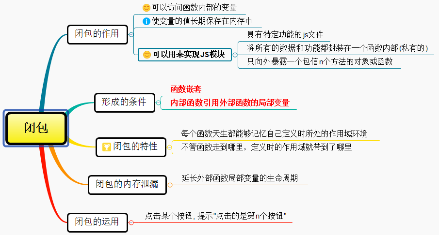
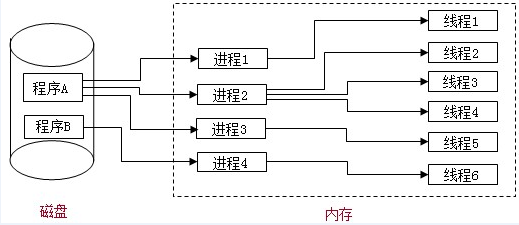
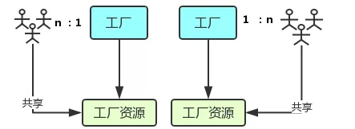
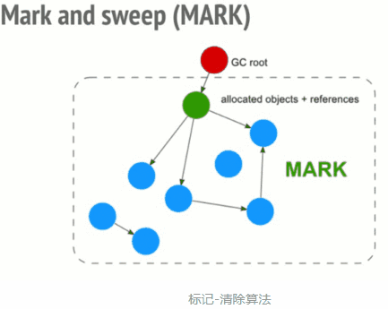

来源：[浪里行舟](https://github.com/ljianshu/Blog)
### <div align=center>前端模块化详解

---

在 JavaScript 发展初期就是为了实现简单的页面交互逻辑，寥寥数语即可；如今 CPU、浏览器性能得到了极大的提升，很多页面逻辑迁移到了客户端（表单验证等），随着 web2.0 时代的到来，Ajax 技术得到广泛应用，jQuery 等前端库层出不穷，前端代码日益膨胀，此时在 JS 方面就会考虑使用模块化规范去管理。


#### 模块化的理解

1. 什么是模块

- 将一个复杂的程序依据一定的规则(规范)封装成几个块(文件), 并进行组合在一起
- 块的内部数据与实现是私有的, 只是向外部暴露一些接口(方法)与外部其它模块通信
  <!--more-->

2. 模块化的进化过程
   - 全局 function 模式 : 将不同的功能封装成不同的全局函数
     - 编码: 将不同的功能封装成不同的全局函数
     - 问题: 污染全局命名空间, 容易引起命名冲突或数据不安全，而且模块成员之间看不出直接关系
   - namespace 模式 : 简单对象封装
     - 作用: 减少了全局变量，解决命名冲突
     - 问题: 数据不安全(外部可以直接修改模块内部的数据)
   - IIFE 模式：匿名函数自调用(闭包)
     - 作用: 数据是私有的, 外部只能通过暴露的方法操作
     - 编码: 将数据和行为封装到一个函数内部, 通过给 window 添加属性来向外暴露接口
     - 问题: 如果当前这个模块依赖另一个模块怎么办?
3. 模块化的好处

- 避免命名冲突(减少命名空间污染)
- 更好的分离, 按需加载
- 更高复用性
- 高可维护性

4. 引入多个\<script\>后出现出现问题

- 请求过多
- 依赖模糊
- 难以维护

#### 模块化规范

1.  CommonJS

    - 概述
      Node 应用由模块组成，采用 CommonJS 模块规范。每个文件就是一个模块，有自己的作用域。在一个文件里面定义的变量、函数、类，都是私有的，对其他文件不可见。在服务器端，模块的加载是运行时同步加载的；在浏览器端，模块需要提前编译打包处理。
    - 特点
      - 所有代码都运行在模块作用域，不会污染全局作用域。
      - 模块可以多次加载，但是只会在第一次加载时运行一次，然后运行结果就被缓存了，以后再加载，就直接读取缓存结果。要想让模块再次运行，必须清除缓存。
      - 模块加载的顺序，按照其在代码中出现的顺序。
    - 基本语法
      - 暴露模块：module.exports = value 或 exports.xxx = value
      - 引入模块：require(xxx),如果是第三方模块，xxx 为模块名；如果是自定义模块，xxx 为模块文件路径
        CommonJS 规范规定，每个模块内部，module 变量代表当前模块。**这个变量是一个对象**，它的 exports 属性（即 module.exports）是对外的接口。加载某个模块，其实是加载该模块的 module.exports 属性。

    ```javascript
    // example.js
    var x = 5;
    var addX = function(value) {
      return value + x;
    };
    module.exports.x = x;
    module.exports.addX = addX;

    var example = require('./example.js'); //如果参数字符串以“./”开头，则表示加载的是一个位于相对路径
    console.log(example.x); // 5
    console.log(example.addX(1)); // 6
    ```

    require 命令用于加载模块文件。require 命令的基本功能是，读入并执行一个 JavaScript 文件，然后返回该模块的 exports 对象。如果没有发现指定模块，会报错。

    - 模块的加载机制
      CommonJS 模块的加载机制是，输入的是被输出的值的拷贝。也就是说，一旦输出一个值，模块内部的变化就影响不到这个值。

2.  AMD
    CommonJS 规范加载模块是同步的，也就是说，只有加载完成，才能执行后面的操作。AMD 规范则是非同步加载模块，允许指定回调函数。由于 Node.js 主要用于服务器编程，模块文件一般都已经存在于本地硬盘，所以加载起来比较快，不用考虑非同步加载的方式，所以 CommonJS 规范比较适用。但是，如果是浏览器环境，要从服务器端加载模块，这时就必须采用非同步模式，因此浏览器端一般采用 AMD 规范。

    - AMD 规范基本语法

    ```javascript
    //定义暴露模块:
    //定义没有依赖的模块
    define(function() {
      return 模块;
    });

    //定义有依赖的模块
    define(['module1', 'module2'], function(m1, m2) {
      return 模块;
    });

    //引入使用模块:
    require(['module1', 'module2'], function(m1, m2) {
      //使用m1/m2
    });
    ```

3.  CMD
    CMD 规范专门用于浏览器端，模块的加载是异步的，模块使用时才会加载执行。CMD 规范整合了 CommonJS 和 AMD 规范的特点。在 Sea.js 中，所有 JavaScript 模块都遵循 CMD 模块定义规范。

4.  ES6 模块化
    ES6 模块的设计思想是尽量的静态化，使得编译时就能确定模块的依赖关系，以及输入和输出的变量。CommonJS 和 AMD 模块，都只能在运行时确定这些东西。比如，CommonJS 模块就是对象，输入时必须查找对象属性。

    - ES6 模块化语法
      export 命令用于规定模块的对外接口，import 命令用于输入其他模块提供的功能。
      `javascript /** 定义模块 math.js **/ var basicNum = 0; var add = function(a, b) { return a + b; }; export { basicNum, add }; /** 引用模块 **/ import { basicNum, add } from './math'; function test(ele) { ele.textContent = add(99 + basicNum); }`
      使用 import 命令的时候，用户需要知道所要加载的变量名或函数名，否则无法加载。为了给用户提供方便，让他们不用阅读文档就能加载模块，就要用到 export default 命令，为模块指定默认输出。

      ```javascript
      // export-default.js
      export default function() {
        console.log('foo');
      }

      // import-default.js
      import customName from './export-default';
      customName(); // 'foo'

      //模块默认输出, 其他模块加载该模块时，import命令可以为该匿名函数指定任意名字。
      ```

    - ES6 模块与 CommonJS 模块的差异
      - CommonJS 模块输出的是一个值的拷贝，ES6 模块输出的是值的引用。
      - CommonJS 模块是运行时加载，ES6 模块是编译时输出接口。
        第二个差异是因为 CommonJS 加载的是一个对象（即 module.exports 属性），该对象只有在脚本运行完才会生成。而 ES6 模块不是对象，它的对外接口只是一种静态定义，在代码静态解析阶段就会生成。
        ```javascript
        // lib.js
        export let counter = 3;
        export function incCounter() {
          counter++;
        }
        // main.js
        import { counter, incCounter } from './lib';
        console.log(counter); // 3
        incCounter();
        console.log(counter); // 4
        ```

#### 总结

- CommonJS 规范主要用于服务端编程，加载模块是同步的，这并不适合在浏览器环境，因为同步意味着阻塞加载，浏览器资源是异步加载的，因此有了 AMD CMD 解决方案。
- AMD 规范在浏览器环境中异步加载模块，而且可以并行加载多个模块。不过，AMD 规范开发成本高，代码的阅读和书写比较困难，模块定义方式的语义不顺畅。
- CMD 规范与 AMD 规范很相似，都用于浏览器编程，依赖就近，延迟执行，可以很容易在 Node.js 中运行。不过，依赖 SPM 打包，模块的加载逻辑偏重
- **ES6 在语言标准的层面上，实现了模块功能，而且实现得相当简单，完全可以取代 CommonJS 和 AMD 规范，成为浏览器和服务器通用的模块解决方案。**

### <div align=center>跨域方式实现原理

---

#### 什么是跨域

1. 同源策略及其限制内容
   同源策略是一种约定，它是浏览器最核心也最基本的安全功能，如果缺少了同源策略，浏览器很容易受到 XSS、CSRF 等攻击。所谓同源是指"协议+域名+端口"三者相同，即便两个不同的域名指向同一个 ip 地址，也非同源。

同源策略限制内容有：

- Cookie、LocalStorage、IndexedDB 等存储性内容
- DOM 节点
- AJAX 请求发送后，结果被浏览器拦截了

有三个标签是允许跨域加载资源：

- \
- \<link href=XXX>
- \<script src=XXX>

2. 常见跨域场景
   当协议、子域名、主域名、端口号中任意一个不相同时，都算作不同域。不同域之间相互请求资源，就算作“跨域”。

特别说明：

- 如果是协议和端口造成的跨域问题“前台”是无能为力的。
- 在跨域问题上，仅仅是通过“URL 的首部”来识别而不会根据域名对应的 IP 地址是否相同来判断。“URL 的首部”可以理解为“协议, 域名和端口必须匹配”。

#### 跨域解决方案

1. jsonp

- 原理：
  利用\<script\> 标签没有跨域限制的漏洞，网页可以得到从其他来源动态产生的 JSON 数据。JSONP 请求一定需要对方的服务器做支持才可以。

- JSONP 和 AJAX 对比：
  JSONP 和 AJAX 相同，都是客户端向服务器端发送请求，从服务器端获取数据的方式。但 AJAX 属于同源策略，JSONP 属于非同源策略（跨域请求）

- JSONP 优缺点：
  JSONP 优点是简单兼容性好，可用于解决主流浏览器的跨域数据访问的问题。缺点是仅支持 get 方法具有局限性,不安全可能会遭受 XSS 攻击。

- JSONP 的实现流程：
  - 声明一个回调函数，其函数名(如 show)当做参数值，要传递给跨域请求数据的服务器，函数形参为要获取目标数据(服务器返回的 data)。
  - 创建一个\<script\>标签，把那个跨域的 API 数据接口地址，赋值给 script 的 src,还要在这个地址中向服务器传递该函数名（可以通过问号传参:?callback=show）。
  - 服务器接收到请求后，需要进行特殊的处理：把传递进来的函数名和它需要给你的数据拼接成一个字符串,例如：传递进去的函数名是 show，它准备好的数据是 show('我不爱你')。
  - 最后服务器把准备的数据通过 HTTP 协议返回给客户端，客户端再调用执行之前声明的回调函数（show），对返回的数据进行操作。

自己封装一个 JSONP 函数

```javascript
function jsonp({ url, params, callback }) {
  return new Promise((resolve, reject) => {
    let script = document.createElement('script');
    window[callback] = function(data) {
      resolve(data);
      document.body.removeChild(script);
    };
    params = { ...params, callback }; // wd=b&callback=show
    let arrs = [];
    for (let key in params) {
      arrs.push(`${key}=${params[key]}`);
    }
    script.src = `${url}?${arrs.join('&')}`;
    document.body.appendChild(script);
  });
}
jsonp({
  url: 'http://localhost:3000/say',
  params: { wd: 'Iloveyou' },
  callback: 'show',
}).then(data => {
  console.log(data);
});
```

这段代码相当于向http://localhost:3000/say?wd=Iloveyou&callback=show这个地址请求数据，然后后台返回show('我不爱你')，最后会运行show()这个函数，打印出'我不爱你'

```javascript
// server.js
let express = require('express');
let app = express();
app.get('/say', function(req, res) {
  let { wd, callback } = req.query;
  console.log(wd); // Iloveyou
  console.log(callback); // show
  res.end(`${callback}('我不爱你')`);
});
app.listen(3000);
```

- jQuery 的 jsonp 形式

JSONP 都是 GET 和异步请求的，不存在其他的请求方式和同步请求，且 jQuery 默认就会给 JSONP 的请求清除缓存。

```javascript
$.ajax({
  url: 'http://crossdomain.com/jsonServerResponse',
  dataType: 'jsonp',
  type: 'get', //可以省略
  jsonpCallback: 'show', //->自定义传递给服务器的函数名，而不是使用jQuery自动生成的，可省略
  jsonp: 'callback', //->把传递函数名的那个形参callback，可省略
  success: function(data) {
    console.log(data);
  },
});
```

2. cors

CORS 需要浏览器和后端同时支持。IE 8 和 9 需要通过 XDomainRequest 来实现。

浏览器会自动进行 CORS 通信，实现 CORS 通信的关键是后端。只要后端实现了 CORS，就实现了跨域。

服务端设置 Access-Control-Allow-Origin 就可以开启 CORS。 该属性表示哪些域名可以访问资源，如果设置通配符则表示所有网站都可以访问资源。

虽然设置 CORS 和前端没什么关系，但是通过这种方式解决跨域问题的话，会在发送请求时出现两种情况，分别为**简单请求**和**复杂请求**。

- **简单请求**

只要同时满足以下两大条件，就属于简单请求

条件 1：使用下列方法之一：

- GET
- HEAD
- POST

条件 2：Content-Type 的值仅限于下列三者之一：

- text/plain
- multipart/form-data
- application/x-www-form-urlencoded

* **复杂请求**

不符合以上条件的请求就肯定是复杂请求了。
复杂请求的 CORS 请求，会在正式通信之前，增加一次 HTTP 查询请求，称为"预检"请求,该请求是 option 方法的，通过该请求来知道服务端是否允许跨域请求。

我们用 PUT 向后台请求时，属于复杂请求，后台需做如下配置：

```javascript
// 允许哪个方法访问我
res.setHeader('Access-Control-Allow-Methods', 'PUT');
// 预检的存活时间
res.setHeader('Access-Control-Max-Age', 6);
// OPTIONS请求不做任何处理
if (req.method === 'OPTIONS') {
  res.end();
}
// 定义后台返回的内容
app.put('/getData', function(req, res) {
  console.log(req.headers);
  res.end('我不爱你');
});
```

一个完整复杂请求的例子，并且介绍下 CORS 请求相关的字段

```javascript
// index.html
let xhr = new XMLHttpRequest();
document.cookie = 'name=xiamen'; // cookie不能跨域
xhr.withCredentials = true; // 前端设置是否带cookie
xhr.open('PUT', 'http://localhost:4000/getData', true);
xhr.setRequestHeader('name', 'xiamen');
xhr.onreadystatechange = function() {
  if (xhr.readyState === 4) {
    if ((xhr.status >= 200 && xhr.status < 300) || xhr.status === 304) {
      console.log(xhr.response);
      //得到响应头，后台需设置Access-Control-Expose-Headers
      console.log(xhr.getResponseHeader('name'));
    }
  }
};
xhr.send();

//server1.js
let express = require('express');
let app = express();
app.use(express.static(__dirname));
app.listen(3000);

//server2.js
let express = require('express');
let app = express();
let whitList = ['http://localhost:3000']; //设置白名单
app.use(function(req, res, next) {
  let origin = req.headers.origin;
  if (whitList.includes(origin)) {
    // 设置哪个源可以访问我
    res.setHeader('Access-Control-Allow-Origin', origin);
    // 允许携带哪个头访问我
    res.setHeader('Access-Control-Allow-Headers', 'name');
    // 允许哪个方法访问我
    res.setHeader('Access-Control-Allow-Methods', 'PUT');
    // 允许携带cookie
    res.setHeader('Access-Control-Allow-Credentials', true);
    // 预检的存活时间
    res.setHeader('Access-Control-Max-Age', 6);
    // 允许返回的头
    res.setHeader('Access-Control-Expose-Headers', 'name');
    if (req.method === 'OPTIONS') {
      res.end(); // OPTIONS请求不做任何处理
    }
  }
  next();
});
app.put('/getData', function(req, res) {
  console.log(req.headers);
  res.setHeader('name', 'jw'); //返回一个响应头，后台需设置
  res.end('我不爱你');
});
app.get('/getData', function(req, res) {
  console.log(req.headers);
  res.end('我不爱你');
});
app.use(express.static(__dirname));
app.listen(4000);
```

3. postMessage

postMessage 是 HTML5 XMLHttpRequest Level 2 中的 API，且是为数不多可以跨域操作的 window 属性之一，它可用于解决以下方面的问题：

- 页面和其打开的新窗口的数据传递
- 多窗口之间消息传递
- 页面与嵌套的 iframe 消息传递
- 上面三个场景的跨域数据传递

postMessage()方法允许来自不同源的脚本采用异步方式进行有限的通信，可以实现跨文本档、多窗口、跨域消息传递。

otherWindow.postMessage(message, targetOrigin, [transfer]);

4. websocket

Websocket 是 HTML5 的一个持久化的协议，它实现了浏览器与服务器的全双工通信，同时也是跨域的一种解决方案。WebSocket 和 HTTP 都是应用层协议，都基于 TCP 协议。但是 WebSocket 是一种双向通信协议，在建立连接之后，WebSocket 的 server 与 client 都能主动向对方发送或接收数据。同时，WebSocket 在建立连接时需要借助 HTTP 协议，连接建立好了之后 client 与 server 之间的双向通信就与 HTTP 无关了。

5. Node 中间件代理(两次跨域)

实现原理：同源策略是浏览器需要遵循的标准，而如果是服务器向服务器请求就无需遵循同源策略。
代理服务器，需要做以下几个步骤：

- 接受客户端请求 。
- 将请求转发给服务器。
- 拿到服务器响应数据。
- 将响应转发给客户端。

本地文件 index.html 文件，通过代理服务器http://localhost:3000向目标服务器http://localhost:4000请求数据。

```javascript
// index.html(http://127.0.0.1:5500)
<script src="https://cdn.bootcss.com/jquery/3.3.1/jquery.min.js"></script>
<script>
  $.ajax({
    url: 'http://localhost:3000',
    type: 'post',
    data: { name: 'xiamen', password: '123456' },
    contentType: 'application/json;charset=utf-8',
    success: function(result) {
      console.log(result) // {"title":"fontend","password":"123456"}
    },
    error: function(msg) {
      console.log(msg)
    }
  })
</script>

// server1.js 代理服务器(http://localhost:3000)
const http = require('http')
// 第一步：接受客户端请求
const server = http.createServer((request, response) => {
  // 代理服务器，直接和浏览器直接交互，需要设置CORS 的首部字段
  response.writeHead(200, {
    'Access-Control-Allow-Origin': '*',
    'Access-Control-Allow-Methods': '*',
    'Access-Control-Allow-Headers': 'Content-Type'
  })
  // 第二步：将请求转发给服务器
  const proxyRequest = http
    .request(
      {
        host: '127.0.0.1',
        port: 4000,
        url: '/',
        method: request.method,
        headers: request.headers
      },
      serverResponse => {
        // 第三步：收到服务器的响应
        var body = ''
        serverResponse.on('data', chunk => {
          body += chunk
        })
        serverResponse.on('end', () => {
          console.log('The data is ' + body)
          // 第四步：将响应结果转发给浏览器
          response.end(body)
        })
      }
    )
    .end()
})
server.listen(3000, () => {
  console.log('The proxyServer is running at http://localhost:3000')
})

// server2.js(http://localhost:4000)
const http = require('http')
const data = { title: 'fontend', password: '123456' }
const server = http.createServer((request, response) => {
  if (request.url === '/') {
    response.end(JSON.stringify(data))
  }
})
server.listen(4000, () => {
  console.log('The server is running at http://localhost:4000')
})
```

6. nginx 反向代理

实现原理类似于 Node 中间件代理，需要你搭建一个中转 nginx 服务器，用于转发请求。

使用 nginx 反向代理实现跨域，是最简单的跨域方式。只需要修改 nginx 的配置即可解决跨域问题，支持所有浏览器，支持 session，不需要修改任何代码，并且不会影响服务器性能。

实现思路：通过 nginx 配置一个代理服务器（域名与 domain1 相同，端口不同）做跳板机，反向代理访问 domain2 接口，并且可以顺便修改 cookie 中 domain 信息，方便当前域 cookie 写入，实现跨域登录。

先下载 nginx，然后将 nginx 目录下的 nginx.conf 修改如下:

```
// proxy服务器
server {
    listen       80;
    server_name  www.domain1.com;
    location / {
        proxy_pass   http://www.domain2.com:8080;  #反向代理
        proxy_cookie_domain www.domain2.com www.domain1.com; #修改cookie里域名
        index  index.html index.htm;

        # 当用webpack-dev-server等中间件代理接口访问nignx时，此时无浏览器参与，故没有同源限制，下面的跨域配置可不启用
        add_header Access-Control-Allow-Origin http://www.domain1.com;  #当前端只跨域不带cookie时，可为*
        add_header Access-Control-Allow-Credentials true;
    }
}
```

最后通过命令行 nginx -s reload 启动 nginx

```javascript
// index.html
var xhr = new XMLHttpRequest();
// 前端开关：浏览器是否读写cookie
xhr.withCredentials = true;
// 访问nginx中的代理服务器
xhr.open('get', 'http://www.domain1.com:81/?user=admin', true);
xhr.send();

// server.js
var http = require('http');
var server = http.createServer();
var qs = require('querystring');
server.on('request', function(req, res) {
  var params = qs.parse(req.url.substring(2));
  // 向前台写cookie
  res.writeHead(200, {
    'Set-Cookie': 'l=a123456;Path=/;Domain=www.domain2.com;HttpOnly', // HttpOnly:脚本无法读取
  });
  res.write(JSON.stringify(params));
  res.end();
});
server.listen('8080');
console.log('Server is running at port 8080...');
```

### <div align=center>JavaScript 的数据类型及其检测

---


#### JavaScript 有几种类型的值

Javascript 有两种数据类型，分别是基本数据类型和引用数据类型。其中基本数据类型包括 Undefined、Null、Boolean、Number、String、Symbol (ES6 新增，表示独一无二的值)，而引用数据类型统称为 Object 对象，主要包括对象、数组和函数。

#### 基本数据类型

1. 值是不可变的

   ```javascript
   var name = 'java';
   name.toUpperCase(); // 输出 'JAVA'
   console.log(name); // 输出  'java'
   ```

2. 存放在栈区
   原始数据类型直接存储在栈(stack)中的简单数据段，占据空间小、大小固定，属于被频繁使用数据，所以放入栈中存储。
3. 值的比较
   ```javascript
   var a = 1;
   var b = true;
   console.log(a == b); // true
   console.log(a === b); // false
   ```
   == : 只进行值的比较,会进行数据类型的转换。
   === : 不仅进行值得比较，还要进行数据类型的比较。

#### 引用数据类型

1. 值是可变的
   ```javascript
   var a={age:20}；
   a.age=21；
   console.log(a.age)//21
   ```
2. 同时保存在栈内存和堆内存
   引用数据类型存储在堆(heap)中的对象,占据空间大、大小不固定,如果存储在栈中，将会影响程序运行的性能；引用数据类型在栈中存储了指针，该指针指向堆中该实体的起始地址。当解释器寻找引用值时，会首先检索其在栈中的地址，取得地址后从堆中获得实体。
   
3. 比较是引用的比较
   当从一个变量向另一个变量赋引用类型的值时，同样也会将存储在变量中的对象的值复制一份放到为新变量分配的空间中。

#### 检验数据类型

1. typeof
   typeof 返回一个表示数据类型的字符串，返回结果包括：number、boolean、string、symbol、object、undefined、function 等 7 种数据类型，但不能判断 null、array 等
2. instanceof
   instanceof 是用来判断 A 是否为 B 的实例，表达式为：A instanceof B，如果 A 是 B 的实例，则返回 true,否则返回 false。instanceof 运算符用来测试一个对象在其原型链中是否存在一个构造函数的 prototype 属性。
   instanceof 三大弊端：
   - 对于基本数据类型来说，字面量方式创建出来的结果和实例方式创建的是有一定的区别的
     ```javascript
     console.log(1 instanceof Number); //false
     console.log(new Number(1) instanceof Number); //true
     ```
   - 只要在当前实例的原型链上，我们用其检测出来的结果都是 true。在类的原型继承中，我们最后检测出来的结果未必准确。
     ```javascript
     var arr = [1, 2, 3];
     console.log(arr instanceof Array); // true
     console.log(arr instanceof Object); // true
     function fn() {}
     console.log(fn instanceof Function); // true
     console.log(fn instanceof Object); // true
     ```
   - 不能检测 null 和 undefined
3. constructor
   constructor 作用和 instanceof 非常相似。但 constructor 检测 Object 与 instanceof 不一样，还可以处理基本数据类型的检测。
   constructor 两大弊端：
   - null 和 undefined 是无效的对象，因此是不会有 constructor 存在的，这两种类型的数据需要通过其他方式来判断。
   - 函数的 constructor 是不稳定的，这个主要体现在把类的原型进行重写，在重写的过程中很有可能出现把之前的 constructor 给覆盖了，这样检测出来的结果就是不准确的
4. Object.prototype.toString.call()
   Object.prototype.toString.call() 最准确最常用的方式。首先获取 Object 原型上的 toString 方法，让方法执行，让 toString 方法中的 this 指向第一个参数的值。

关于 toString 重要补充说明：

- 本意是转换为字符串，但是某些 toString 方法不仅仅是转换为字符串
- 对于 Number、String，Boolean，Array，RegExp、Date、Function 原型上的 toString 方法都是把当前的数据类型转换为字符串的类型（它们的作用仅仅是用来转换为字符串的）
- Object 上的 toString 并不是用来转换为字符串的。

### <div align=center>JavaScript 数据类型转换

---

JavaScript 是一门动态语言，所谓的动态语言可以暂时理解为在语言中的一切内容都是不确定的。比如一个变量，这一时刻是个整型，下一时刻可能会变成字符串了。虽然变量的数据类型是不确定的，但是各种运算符对数据类型是有要求的。如果运算符发现，运算子的类型与预期不符，就会自动转换类型。

自动转换是基于强制转换之上的。强制转换主要指使用 Number、String 和 Boolean 三个函数，手动将各种类型的值，分布转换成数字、字符串或者布尔值。

#### 强制转换

1. 其他的数据类型转换为 String
   方式一：toString()方法

   - 调用被转换数据类型的 toString()方法,该方法不会影响到原变量，它会将转换的结果返回，但是注意：**null 和 undefined 这两个值没有 toString，如果调用他们的方法，会报错**。
   - 采用 Number 类型的 toString() 方法的基模式，可以用不同的基输出数字，例如二进制的基是 2，八进制的基是 8，十六进制的基是 16

     ```javascript
     var iNum = 10;
     alert(iNum.toString(2)); //输出 "1010"
     alert(iNum.toString(8)); //输出 "12"
     alert(iNum.toString(16)); //输出 "A"
     ```

   方式二：String()函数

   - 使用 String()函数做强制类型转换时，对于 Number 和 Boolean 实际上就是调用的 toString()方法,但是对于 null 和 undefined，就不会调用 toString()方法,它会将 null 直接转换为"null",将 undefined 直接转换为"undefined"
   - String 方法的参数如果是对象，返回一个类型字符串；如果是数组，返回该数组的字符串形式。

2. 其他的数据类型转换为 Number
   方式一：使用 Number()函数

   - 原始类型值
     - 字符串转数字
       - 如果是纯数字的字符串，则直接将其转换为数字
       - 如果字符串中有非数字的内容，则转换为 NaN
       - 如果字符串是一个空串或者是一个全是空格的字符串，则转换为 0
     - 布尔值转数字:true 转成 1,false 转成 0
     - undefined 转数字:转成 NaN
     - null 转数字：转成 0
     - Number() 接受数值作为参数，此时它既能识别负的十六进制，也能识别 0 开头的八进制，返回值永远是十进制值
   - 对象
     简单的规则是，Number 方法的参数是对象时，将返回 NaN，除非是包含单个数值的数组。
     ```javascript
     Number({ a: 1 }); // NaN
     Number([1, 2, 3]); // NaN
     Number([5]); // 5
     ```

   方式二：parseInt() & parseFloat()
   这种方式专门用来对付字符串，parseInt()一个字符串转换为一个整数,可以将一个字符串中的有效的整数内容取出来，然后转换为 Number。parseFloat()把一个字符串转换为一个浮点数。parseFloat()作用和 parseInt()类似，不同的是它可以获得有效的小数。
   parseInt()在没有第二个参数时默认以十进制转换数值，有第二个参数时，以第二个参数为基数转换数值，如果基数有误返回 NaN

   **两者的区别：Number 函数将字符串转为数值，要比 parseInt 函数严格很多。基本上，只要有一个字符无法转成数值，整个字符串就会被转为 NaN。**

3. 其他的数据类型转换为 Boolean
   它的转换规则相对简单：只有空字符串("")、null、undefined、+0、-0 和 NaN 转为布尔型是 false，其他的都是 true

#### 自动转换

遇到以下三种情况时，JavaScript 会自动转换数据类型，即转换是自动完成的，用户不可见。

1. 自动转换为布尔值
   JavaScript 遇到预期为布尔值的地方(比如 if 语句的条件部分),就会将非布尔值的参数自动转换为布尔值。系统内部会自动调用 Boolean 函数。
2. 自动转换为数值
   算数运算符(+ - \* /)跟非 Number 类型的值进行运算时，会将这些值转换为 Number，然后在运算，除了字符串的加法运算
3. 自动转换为字符串
   字符串的自动转换，主要发生在字符串的加法运算时。当一个值为字符串，另一个值为非字符串，则后者转为字符串。

### <div align=center>深入理解 JavaScript 作用域和作用域链

---

#### 作用域(Scope)

1. 什么是作用域
   作用域是在运行时代码中的某些特定部分中变量，函数和对象的可访问性。换句话说，作用域决定了代码区块中变量和其他资源的可见性。(作用域（scope）指的是变量存在的范围。)
   作用域就是一个独立的地盘，让变量不会外泄、暴露出去。也就是说作用域最大的用处就是隔离变量，不同作用域下同名变量不会有冲突。
   ES6 之前 JavaScript 没有块级作用域,只有全局作用域和函数作用域。ES6 的到来，为我们提供了‘块级作用域’,可通过新增命令 let 和 const 来体现。
2. 全局作用域和函数作用域

   - 最外层函数 和在最外层函数外面定义的变量拥有全局作用域
   - 所有末定义直接赋值的变量自动声明为拥有全局作用域
   - 所有 window 对象的属性拥有全局作用域

全局作用域有个弊端：如果我们写了很多行 JS 代码，变量定义都没有用函数包括，那么它们就全部都在全局作用域中。这样就会 污染全局命名空间, 容易引起命名冲突。

函数作用域,是指声明在函数内部的变量，和全局作用域相反，局部作用域一般只在固定的代码片段内可访问到，最常见的例如函数内部。
作用域是分层的，内层作用域可以访问外层作用域的变量，反之则不行。

**块语句（大括号“｛｝”中间的语句），如 if 和 switch 条件语句或 for 和 while 循环语句，不像函数，它们不会创建一个新的作用域**。在块语句中定义的变量将保留在它们已经存在的作用域中。

```javascript
if (true) {
  // 'if' 条件语句块不会创建一个新的作用域
  var name = 'Hammad'; // name 依然在全局作用域中
}
console.log(name); // logs 'Hammad'
```

会发生变量提升。正因为如此， ES6 引入了块级作用域，让变量的生命周期更加可控。

3. 块级作用域
   块级作用域可通过新增命令 let 和 const 声明，所声明的变量在指定块的作用域外无法被访问。块级作用域在如下情况被创建：

   - 在一个函数内部
   - 在一个代码块（由一对花括号包裹）内部

let 声明的语法与 var 的语法一致。你基本上可以用 let 来代替 var 进行变量声明，但会将变量的作用域限制在当前代码块中。块级作用域有以下几个特点：

- 声明变量不会提升到代码块顶部
- 禁止重复声明
- 循环中的绑定块作用域的妙用
  ```javascript
  for (let i = 0; i < 10; i++) {
    // ...
  }
  console.log(i);
  // ReferenceError: i is not defined
  ```

#### 作用域链

1. 什么是自由变量
   首先认识一下什么叫做 自由变量 。如下代码中，console.log(a)要得到 a 变量，但是在当前的作用域中没有定义 a（可对比一下 b）。当前作用域没有定义的变量，这成为 自由变量 。自由变量的值如何得到 —— 向父级作用域寻找（注意：这种说法并不严谨，下文会重点解释）。
   ```javascript
   var a = 100;
   function fn() {
     var b = 200;
     console.log(a); // 这里的a在这里就是一个自由变量
     console.log(b);
   }
   fn();
   ```
2. 什么是作用域链
   如果父级也没呢？再一层一层向上寻找，直到找到全局作用域还是没找到，就宣布放弃。这种一层一层的关系，就是 作用域链 。
   ```javascript
   var a = 100;
   function F1() {
     var b = 200;
     function F2() {
       var c = 300;
       console.log(a); // 自由变量，顺作用域链向父作用域找
       console.log(b); // 自由变量，顺作用域链向父作用域找
       console.log(c); // 本作用域的变量
     }
     F2();
   }
   F1();
   ```
3. 关于自由变量的取值
   关于自由变量的值，上文提到要到父作用域中取，其实有时候这种解释会产生歧义。
   ```javascript
   var x = 10;
   function fn() {
     console.log(x);
   }
   function show(f) {
     var x = 20;
     (function() {
       f(); //10，而不是20
     })();
   }
   show(fn);
   ```
   要到创建这个函数的那个域”。
   作用域中取值,这里强调的是“创建”，而不是“调用”，切记切记——其实这就是所谓的"静态作用域"

#### 作用域与执行上下文

我们知道 JavaScript 属于解释型语言，JavaScript 的执行分为：解释和执行两个阶段,这两个阶段所做的事并不一样：

解释阶段：

- 词法分析
- 语法分析
- 作用域规则确定

执行阶段：

- 创建执行上下文
- 执行函数代码
- 垃圾回收

JavaScript 解释阶段便会确定作用域规则，因此作用域在函数定义时就已经确定了，而不是在函数调用时确定，但是执行上下文是函数执行之前创建的。执行上下文最明显的就是 this 的指向是执行时确定的。而作用域访问的变量是编写代码的结构确定的。

作用域和执行上下文之间最大的区别是：
**执行上下文在运行时确定，随时可能改变；作用域在定义时就确定，并且不会改变。**

### <div align=center>JavaScript 执行上下文和执行栈

---

#### 执行上下文（Execution Context）

1. 什么是执行上下文
   执行上下文就是当前 JavaScript 代码被解析和执行时所在环境的抽象概念， JavaScript 中运行任何的代码都是在执行上下文中运行
2. 执行上下文的类型
   执行上下文总共有三种类型：
   - 全局执行上下文： 这是默认的、最基础的执行上下文。不在任何函数中的代码都位于全局执行上下文中。它做了两件事：1. 创建一个全局对象，在浏览器中这个全局对象就是 window 对象。2. 将 this 指针指向这个全局对象。一个程序中只能存在一个全局执行上下文。
   - 函数执行上下文： 每次调用函数时，都会为该函数创建一个新的执行上下文。每个函数都拥有自己的执行上下文，但是只有在函数被调用的时候才会被创建。一个程序中可以存在任意数量的函数执行上下文。每当一个新的执行上下文被创建，它都会按照特定的顺序执行一系列步骤
   - Eval 函数执行上下文： 运行在 eval 函数中的代码也获得了自己的执行上下文，但由于 Javascript 开发人员不常用 eval 函数，所以在这里不再讨论。

#### 执行上下文的生命周期

执行上下文的生命周期包括三个阶段：**创建阶段 → 执行阶段 → 回收阶段**

1. 创建阶段
   当函数被调用，但未执行任何其内部代码之前，会做以下三件事：
   - 创建变量对象：首先初始化函数的参数 arguments，提升函数声明和变量声明。
   - 创建作用域链（Scope Chain）：在执行期上下文的创建阶段，作用域链是在变量对象之后创建的。作用域链本身包含变量对象。作用域链用于解析变量。当被要求解析变量时，JavaScript 始终从代码嵌套的最内层开始，如果最内层没有找到变量，就会跳转到上一层父作用域中查找，直到找到该变量。
   - 确定 this 指向：包括多种情况

在一段 JS 脚本执行之前，要先解析代码（所以说 JS 是解释执行的脚本语言），解析的时候会先创建一个全局执行上下文环境，先把代码中即将执行的变量、函数声明都拿出来。变量先暂时赋值为 undefined，函数则先声明好可使用。这一步做完了，然后再开始正式执行程序。

另外，一个函数在执行之前，也会创建一个函数执行上下文环境，跟全局上下文差不多，不过 函数执行上下文中会多出 this arguments 和函数的参数。

2. 执行阶段
   执行变量赋值、代码执行

3. 回收阶段
   执行上下文出栈等待虚拟机回收执行上下文

#### 变量提升和 this 指向的细节

1. 变量声明提升
   大部分编程语言都是先声明变量再使用，但在 JS 中，事情有些不一样：

   ```javascript
   console.log(a); // undefined
   var a = 10;

   //相当于
   var a; //声明 默认值是undefined “准备工作”
   console.log(a);
   a = 10; //赋值
   ```

2. 函数声明提升
   创建一个函数的方法有两种，一种是通过函数声明 function foo(){}
   另一种是通过函数表达式 var foo = function(){}

   ```javascript
   console.log(f1); // function f1(){}
   function f1() {} // 函数声明
   console.log(f2); // undefined
   var f2 = function() {}; // 函数表达式

   //一个例子
   function test() {
     foo(); // Uncaught TypeError "foo is not a function"
     bar(); // "this will run!"
     var foo = function() {
       // function expression assigned to local variable 'foo'
       alert("this won't run!");
     };
     function bar() {
       // function declaration, given the name 'bar'
       alert('this will run!');
     }
   }
   test();
   ```

   遇到函数表达式 var foo = function(){}时，首先会将 var foo 上升到函数体顶部，然而此时的 foo 的值为 undefined,所以执行 foo()报错。
   当遇到函数和变量同名且都会被提升的情况，函数声明优先级比较高，因此变量声明会被函数声明所覆盖，但是可以重新赋值。

   ```javascript
   alert(a); //输出：function a(){ alert('我是函数') }
   function a() {
     alert('我是函数');
   } //
   var a = '我是变量';
   alert(a); //输出：'我是变量'

   //一个复杂的例子
   function test(arg) {
     // 1. 形参 arg 是 "hi"
     // 2. 因为函数声明比变量声明优先级高，所以此时 arg 是 function
     console.log(arg);
     var arg = 'hello'; // 3.var arg 变量声明被忽略， arg = 'hello'被执行
     function arg() {}
     console.log(arg);
   }
   test('hi');
   /* 输出：
    function arg(){
        console.log('hello world') 
        }
    hello 
    */
   ```

   当函数执行的时候,首先会形成一个新的私有的作用域，然后依次按照如下的步骤执行：

   - 如果有形参，先给形参赋值
   - 进行私有作用域中的预解释，函数声明优先级比变量声明高，最后后者会被前者所覆盖，但是可以重新赋值
   - 私有作用域中的代码从上到下执行

3. 确定 this 的指向
   **this 的值是在执行的时候才能确认，定义的时候不能确认**
   因为 this 是执行上下文环境的一部分，而执行上下文需要在代码执行之前确定，而不是定义的时候。
   ```javascript
   // 情况1
   function foo() {
     console.log(this.a); //1
   }
   var a = 1;
   foo();
   ```
   对于直接调用 foo 来说，不管 foo 函数被放在了什么地方，this 一定是 window
   ```javascript
   // 情况2
   function fn() {
     console.log(this);
   }
   var obj = { fn: fn };
   obj.fn(); //this->obj
   ```
   对于 obj.fn() 来说，我们只需要记住，谁调用了函数，谁就是 this，所以在这个场景下 fn 函数中的 this 就是 obj 对象
   ```javascript
   // 情况3
   function CreateJsPerson(name, age) {
     //this是当前类的一个实例p1
     this.name = name; //=>p1.name=name
     this.age = age; //=>p1.age=age
   }
   var p1 = new CreateJsPerson('尹华芝', 48);
   ```
   在构造函数模式中，类中(函数体中)出现的 this.xxx=xxx 中的 this 是当前类的一个实例
   ```javascript
   // 情况4
   function add(c, d) {
     return this.a + this.b + c + d;
   }
   var o = { a: 1, b: 3 };
   add.call(o, 5, 7); // 1 + 3 + 5 + 7 = 16
   add.apply(o, [10, 20]); // 1 + 3 + 10 + 20 = 34
   ```
   call、apply 和 bind：this 是第一个参数
   ```javascript
    // 情况5
    <button id="btn1">箭头函数this</button>
    <script type="text/javascript">
        let btn1 = document.getElementById('btn1');
        let obj = {
            name: 'kobe',
            age: 39,
            getName: function () {
                btn1.onclick = () => {
                    console.log(this);//obj
                };
            }
        };
        obj.getName();
    </script>
   ```
   箭头函数 this 指向:箭头函数没有自己的 this，看其外层的是否有函数，如果有，外层函数的 this 就是内部箭头函数的 this，如果没有，则 this 是 window。

#### 执行上下文栈（Execution Context Stack）

JavaScript 引擎创建了执行上下文栈来管理执行上下文。可以把执行上下文栈认为是一个存储函数调用的栈结构，遵循先进后出的原则。


- JavaScript 执行在单线程上，所有的代码都是排队执行。
- 一开始浏览器执行全局的代码时，首先创建全局的执行上下文，压入执行栈的顶部。
- 每当进入一个函数的执行就会创建函数的执行上下文，并且把它压入执行栈的顶部。当前函数执行完成后，当前函数的执行上下文出栈，并等待垃圾回收。
- 浏览器的 JS 执行引擎总是访问栈顶的执行上下文。
- 全局上下文只有唯一的一个，它在浏览器关闭时出栈。

### <div align=center>JavaScript 运行机制

---

#### 理解 JS 的单线程的概念

JavaScript 语言的一大特点就是单线程，也就是说，同一个时间只能做一件事。那么，为什么 JavaScript 不能有多个线程呢？这样能提高效率啊。
JavaScript 的单线程，与它的用途有关。作为浏览器脚本语言，JavaScript 的主要用途是与用户互动，以及操作 DOM。这决定了它只能是单线程，否则会带来很复杂的同步问题。比如，假定 JavaScript 同时有两个线程，一个线程在某个 DOM 节点上添加内容，另一个线程删除了这个节点，这时浏览器应该以哪个线程为准？
所以，为了避免复杂性，从一诞生，JavaScript 就是单线程，这已经成了这门语言的核心特征，将来也不会改变。

#### 理解任务队列(消息队列)

单线程就意味着，所有任务需要排队，前一个任务结束，才会执行后一个任务。如果前一个任务耗时很长，后一个任务就不得不一直等着。
JavaScript 语言的设计者意识到这个问题，将所有任务分成两种，**一种是同步任务（synchronous），另一种是异步任务（asynchronous）**。同步任务指的是，在主线程上排队执行的任务，只有前一个任务执行完毕，才能执行后一个任务；异步任务指的是，不进入主线程、而进入"任务队列"（task queue）的任务，只有"任务队列"通知主线程，某个异步任务可以执行了，该任务才会进入主线程执行。
**异步任务包括宏任务和微任务**

```javascript
console.log('A');
while (true) {}
console.log('B');
//请问最后的输出结果是什么？——A
//因为这是同步任务，程序由上到下执行，遇到while()死循环，下面语句就没办法执行。

console.log('A');
setTimeout(function() {
  console.log('B');
}, 0);
while (true) {}
//请问最后的输出结果是什么？——A
//在所有同步任务执行完之前，任何的异步任务是不会执行的
```

#### 理解 Event Loop

异步执行的运行机制如下：

- 所有同步任务都在主线程上执行，形成一个执行栈（execution context stack）。
- 主线程之外，还存在一个"任务队列"（task queue）。只要异步任务有了运行结果，就在"任务队列"之中放置一个事件。
- 一旦"执行栈"中的所有同步任务执行完毕，系统就会读取"任务队列"，看看里面有哪些事件。那些对应的异步任务，于是结束等待状态，进入执行栈，开始执行。
- 主线程不断重复上面的第三步。

**主线程从"任务队列"中读取事件，这个过程是循环不断的，所以整个的这种运行机制又称为 Event Loop（事件循环）**。只要主线程空了，就会去读取"任务队列"，这就是 JavaScript 的运行机制。这个过程会循环反复。


#### 哪些语句会放入异步任务队列及放入时机

一般来说，有以下四种会放入异步任务队列

- setTimeout 和 setlnterval
- DOM 事件
- ES6 中的 Promise
- Ajax 异步请求

javascript 代码运行分两个阶段：
1、预解析---把所有的函数定义提前，所有的变量声明提前，变量的赋值不提前

2、执行---从上到下执行（按照 js 运行机制）

至于放入异步任务队列的时机，我们通过 setTimeout 的例子和 Ajax 例子来详细说明：

```javascript
//例题1
for (var i = 0; i < 5; i++) {
  setTimeout(function() {
    console.log(i);
  }, 1000);
}
```

for 循环一次碰到一个 setTimeout()，**并不是马上把 setTimeout()拿到异步队列中，而要等到一秒后，才将其放到任务队列里面**，一旦"执行栈"中的所有同步任务执行完毕（即 for 循环结束，此时 i 已经为 5），系统就会读取已经存放"任务队列"的 setTimeout()（有五个），于是答案是输出 5 个 5。

#### 微任务(Microtask)与宏任务(Macrotask)

宏任务队列可以有多个，微任务队列只有一个。

- 宏任务包括：script(全局任务), setTimeout, setInterval, setImmediate, I/O, UI rendering。
- 微任务包括: new Promise().then(回调), process.nextTick, Object.observe(已废弃), MutationObserver(html5 新特性)

**当执行栈中的所有同步任务执行完毕时，是先执行宏任务还是微任务呢**？

- 由于执行代码入口都是全局任务 script，而全局任务属于宏任务，所以当栈为空，同步任务任务执行完毕时，会先执行微任务队列里的任务。
- 微任务队列里的任务全部执行完毕后，会读取宏任务队列中拍最前的任务。
- 执行宏任务的过程中，遇到微任务，依次加入微任务队列。
- 栈空后，再次读取微任务队列里的任务，依次类推。

**当某个宏任务队列的中的任务全部执行完以后,会查看是否有微任务队列。如果有，先执行微任务队列中的所有任务，如果没有，就查看是否有其他宏任务队列。**

```javascript
Promise.resolve().then(() => {
  console.log('Promise1');
  setTimeout(() => {
    console.log('setTimeout2');
  }, 0);
});
setTimeout(() => {
  console.log('setTimeout1');
  Promise.resolve().then(() => {
    console.log('Promise2');
  });
}, 0);

//输出结果是Promise1，setTimeout1，Promise2，setTimeout2
```

### <div align=center>数组常用遍历的方法

---

介绍数组常见遍历方法：forEach、map、filter、find、every、some、reduce，它们有个共同点：不会改变原始数组。

#### forEach：遍历数组

```javascript
var numbers = [1, 2, 3, 4, 5];
var sum = 0;
numbers.forEach(number => (sum += number));
console.log(sum); //15
```

#### map：将数组映射成另一个数组

map 通过指定函数处理数组的每个元素，并返回处理后新的数组，map 不会改变原始数组。
forEach 和 map 的区别在于，forEach 没有返回值。
map 需要返回值，如果不给 return，默认返回 undefined

1. 场景 1
   假定有一个数值数组(A),将 A 数组中的值以双倍的形式放到 B 数组
   ```javascript
   // es6 map方法
   var doubled = numbers.map(function(number) {
     return number * 2;
   });
   console.log(doubled); //[2,4,6]
   ```
2. 场景 2
   假定有一个对象数组(A),将 A 数中对象某个属性的值存储到 B 数组中
   ```javascript
   var cars = [
     { model: 'Buick', price: 'CHEAP' },
     { model: 'BMW', price: 'expensive' },
   ];
   var prices = cars.map(function(car) {
     return car.price;
   });
   console.log(prices); //["CHEAP", "expensive"]
   ```

### filter：从数组中找出所有符合指定条件的元素

filter() 检测数组元素，并返回符合条件所有元素的数组。 filter() 不会改变原始数组。

1. 场景 1
   假定有一个对象数组(A),获取数组中指定类型的对象放到 B 数组中
   ```javascript
   // es6 filter
   var filtered2 = porducts.filter(function(product) {
     return product.type === 'vegetable';
   });
   console.log(filtered2);
   ```
2. 场景 2
   假定有一个对象数组(A),过滤掉不满足条件的对象
   ```javascript
   var products = [
     { name: 'cucumber', type: 'vegetable', quantity: 0, price: 1 },
     { name: 'banana', type: 'fruit', quantity: 10, price: 16 },
     { name: 'celery', type: 'vegetable', quantity: 30, price: 8 },
     { name: 'orange', type: 'fruit', quantity: 3, price: 6 },
   ];
   products = products.filter(function(product) {
     return (
       product.type === 'vegetable' &&
       product.quantity > 0 &&
       product.price < 10
     );
   });
   console.log(products); //[{name:"celery",type:"vegetable",quantity:30,price:8}]
   ```
3. 场景 3
   假定有两个数组(A,B),根据 A 中 id 值,过滤掉 B 数组不符合的数据
   ```javascript
   var post = { id: 4, title: 'Javascript' };
   var comments = [
     { postId: 4, content: 'Angular4' },
     { postId: 2, content: 'Vue.js' },
     { postId: 3, content: 'Node.js' },
     { postId: 4, content: 'React.js' },
   ];
   function commentsForPost(post, comments) {
     return comments.filter(function(comment) {
       return comment.postId === post.id;
     });
   }
   console.log(commentsForPost(post, comments)); //[{postId:4,content:"Angular4"},{postId:4,content
   ```

#### find：返回通过测试（函数内判断）的数组的第一个元素的值

它的参数是一个回调函数，所有数组成员依次执行该回调函数，直到找出第一个返回值为 true 的成员，然后返回该成员。如果没有符合条件的成员，则返回 undefined。

1. 场景 1
   假定有一个对象数组(A),找到符合条件的对象
   ```javascript
   // es6 find
   user = users.find(function(user) {
     return user.name === 'Alex';
   });
   console.log(user); // {name:"Alex",id:2}找到后就终止循环
   ```
2. 场景 2
   假定有一个对象数组(A),根据指定对象的条件找到数组中符合条件的对象
   ```javascript
   var posts = [{ id: 3, title: 'Node.js' }, { id: 1, title: 'React.js' }];
   var comment = { postId: 1, content: 'Hello World!' };
   function postForComment(posts, comment) {
     return posts.find(function(post) {
       return post.id === comment.postId;
     });
   }
   console.log(postForComment(posts, comment)); //{id: 1, title: "React.js"}
   ```

#### every&some

every：数组中是否每个元素都满足指定的条件

some: 数组中是否有元素满足指定的条件

一言以蔽之：**Some: 一真即真；Every: 一假即假**

1. 场景 1
   计算对象数组中每个电脑操作系统是否可用，大于 16 位操作系统表示可用,否则不可用
   ```javascript
   //ES6 some every
   var every = computers.every(function(computer) {
     return computer.ram > 16;
   });
   console.log(every); //false
   var some = computers.some(function(computer) {
     return computer.ram > 16;
   });
   console.log(some); //true
   ```
2. 假定有一个注册页面,判断所有 input 内容的长度是否大于 0
   ```javascript
   function Field(value) {
     this.value = value;
   }
   Field.prototype.validate = function() {
     return this.value.length > 0;
   };
   //ES5方法
   var username = new Field('henrywu');
   var telephone = new Field('18888888888');
   var password = new Field('my_password');
   console.log(username.validate()); //true
   console.log(telephone.validate()); //true
   console.log(password.validate()); //true
   //ES6 some every
   var fields = [username, telephone, password];
   var formIsValid = fields.every(function(field) {
     return field.validate();
   });
   console.log(formIsValid); //true
   if (formIsValid) {
     // 注册成功
   } else {
     // 给用户一个友善的错误提醒
   }
   ```

#### reduce：将数组合成一个值

reduce() 方法接收一个方法作为累加器，数组中的每个值(从左至右) 开始合并，最终为一个值。

1. 场景 1
   计算数组中所有值的总和
   ```javascript
   // es6 reduce
   var sumValue = numbers.reduce(function(sum2, number2) {
     console.log(sum2); //0 10 30 60
     return sum2 + number2;
   }, 0); //sum2初始值为0
   console.log(sumValue);
   ```
2. 场景 2
   将数组中对象的某个属性抽离到另外一个数组中
   ```javascript
   var primaryColors = [
     { color: 'red' },
     { color: 'yellow' },
     { color: 'blue' },
   ];
   var colors = primaryColors.reduce(function(previous, primaryColor) {
     previous.push(primaryColor.color);
     return previous;
   }, []);
   console.log(colors); //["red", "yellow", "blue"]
   ```
3. 场景 3
   判断字符串中括号是否对称
   ```javascript
   function balancedParens(string) {
     return !string.split('').reduce(function(previous, char) {
       if (previous < 0) {
         return previous;
       }
       if (char == '(') {
         return ++previous;
       }
       if (char == ')') {
         return --previous;
       }
       return previous;
     }, 0);
   }
   console.log(balancedParens('((())))'));
   ```

### <div align=center> 浅拷贝与深拷贝

#### 数据类型

数据分为基本数据类型(String, Number, Boolean, Null, Undefined，Symbol)和对象数据类型。

- 基本数据类型的特点：直接存储在栈(stack)中的数据
- 引用数据类型的特点：存储的是该对象在栈中引用，真实的数据存放在堆内存里

#### 浅拷贝与深拷贝

深拷贝和浅拷贝是只针对 Object 和 Array 这样的引用数据类型的。
浅拷贝只复制指向某个对象的指针，而不复制对象本身，新旧对象还是共享同一块内存。但深拷贝会另外创造一个一模一样的对象，新对象跟原对象不共享内存，修改新对象不会改到原对象。

#### 赋值和浅拷贝的区别

- 当我们把一个对象赋值给一个新的变量时，赋的其实是该对象的在栈中的地址，而不是堆中的数据。也就是两个对象指向的是同一个存储空间，无论哪个对象发生改变，其实都是改变的存储空间的内容，因此，两个对象是联动的。
- 浅拷贝是按位拷贝对象，它会创建一个新对象，这个对象有着原始对象属性值的一份精确拷贝。如果属性是基本类型，拷贝的就是基本类型的值；如果属性是内存地址（引用类型），拷贝的就是内存地址 ，因此如果其中一个对象改变了这个地址，就会影响到另一个对象。即默认拷贝构造函数只是对对象进行浅拷贝复制(逐个成员依次拷贝)，即只复制对象空间而不复制资源。

```javascript
// 对象赋值
var obj1 = {
  name: 'zhangsan',
  age: '18',
  language: [1, [2, 3], [4, 5]],
};
var obj2 = obj1;
obj2.name = 'lisi';
obj2.language[1] = ['二', '三'];
console.log('obj1', obj1);
console.log('obj2', obj2);
```


```javascript
// 浅拷贝
var obj1 = {
  name: 'zhangsan',
  age: '18',
  language: [1, [2, 3], [4, 5]],
};
var obj3 = shallowCopy(obj1);
obj3.name = 'lisi';
obj3.language[1] = ['二', '三'];
function shallowCopy(src) {
  var dst = {};
  for (var prop in src) {
    if (src.hasOwnProperty(prop)) {
      dst[prop] = src[prop];
    }
  }
  return dst;
}
console.log('obj1', obj1);
console.log('obj3', obj3);
```


#### 浅拷贝的实现方式

1. Object.assign()
   把任意多个的源对象自身的可枚举属性拷贝给目标对象，然后返回目标对象。但是 Object.assign()进行的是浅拷贝，拷贝的是对象的属性的引用，而不是对象本身。
   ```javascript
   var obj = { a: { a: 'kobe', b: 39 } };
   var initalObj = Object.assign({}, obj);
   initalObj.a.a = 'wade';
   console.log(obj.a.a); //wade
   ```
   **当 object 只有一层的时候，是深拷贝**
   ```javascript
   let obj = {
     username: 'kobe',
   };
   let obj2 = Object.assign({}, obj);
   obj2.username = 'wade';
   console.log(obj); //{username: "kobe"}
   ```
2. Array.prototype.concat()
   ```javascript
   let arr = [
     1,
     3,
     {
       username: 'kobe',
     },
   ];
   let arr2 = arr.concat();
   arr2[2].username = 'wade';
   console.log(arr);
   //修改新对象会改到原对象:
   ```
3. Array.prototype.slice()
   ```javascript
   let arr = [
     1,
     3,
     {
       username: ' kobe',
     },
   ];
   let arr3 = arr.slice();
   arr3[2].username = 'wade';
   console.log(arr);
   //修改新对象会改到原对象:
   ```

Array 的 slice 和 concat 方法不修改原数组，只会返回一个浅复制了原数组中的元素的一个新数组。

- 如果该元素是个对象引用(不是实际的对象)，slice 会拷贝这个对象引用到新的数组里。两个对象引用都引用了同一个对象。如果被引用的对象发生改变，则新的和原来的数组中的这个元素也会发生改变。
- 对于字符串、数字及布尔值来说（不是 String、Number 或者 Boolean 对象），slice 会拷贝这些值到新的数组里。在别的数组里修改这些字符串或数字或是布尔值，将不会影响另一个数组。

#### 深拷贝的实现方式

1. JSON.parse(JSON.stringify())
   **这种方法虽然可以实现数组或对象深拷贝,但不能处理函数**
2. 手写递归方法
   原理：**遍历对象、数组直到里边都是基本数据类型，然后再去复制，就是深度拷贝**
   ```javascript
   //定义检测数据类型的功能函数
   function checkedType(target) {
     return Object.prototype.toString.call(target).slice(8, -1);
   }
   //实现深度克隆---对象/数组
   function clone(target) {
     //判断拷贝的数据类型
     //初始化变量result 成为最终克隆的数据
     let result,
       targetType = checkedType(target);
     if (targetType === 'Object') {
       result = {};
     } else if (targetType === 'Array') {
       result = [];
     } else {
       return target;
     }
     //遍历目标数据
     for (let i in target) {
       //获取遍历数据结构的每一项值。
       let value = target[i];
       //判断目标结构里的每一值是否存在对象/数组
       if (checkedType(value) === 'Object' || checkedType(value) === 'Array') {
         //对象/数组里嵌套了对象/数组
         //继续遍历获取到value值
         result[i] = clone(value);
       } else {
         //获取到value值是基本的数据类型或者是函数。
         result[i] = value;
       }
     }
     return result;
   }
   ```
3. 函数库 lodash
   ```javascript
   var _ = require('lodash');
   var obj1 = {
     a: 1,
     b: { f: { g: 1 } },
     c: [1, 2, 3],
   };
   var obj2 = _.cloneDeep(obj1);
   console.log(obj1.b.f === obj2.b.f);
   // false
   ```

### <div align=center> Javascript 闭包



#### 闭包是什么

```javascript
function f1() {
  var a = 999;
  function f2() {
    console.log(a);
  }
  return f2; // f1返回了f2的引用
}
var result = f1(); // result就是f2函数了
result(); // 执行result，全局作用域下没有a的定义，
//但是函数闭包，能够把定义函数的时候的作用域一起记住，输出999
```

**定义在一个函数内部的函数**
闭包最大的特点，就是它可以“记住”诞生的环境，比如 f2 记住了它诞生的环境 f1，所以从 f2 可以得到 f1 的内部变量。

闭包形成的条件：

- 函数嵌套
- 内部函数引用外部函数的局部变量

#### 闭包的特性

每个函数都是闭包，每个函数天生都能够记忆自己定义时所处的作用域环境。把一个函数从它定义的那个作用域，挪走，运行。这个函数居然能够记忆住定义时的那个作用域。不管函数走到哪里，定义时的作用域就带到了哪里。

```javascript
//例题1
var inner;
function outer() {
  var a = 250;
  inner = function() {
    alert(a); //这个函数虽然在外面执行，但能够记忆住定义时的那个作用域，a是250
  };
}
outer();
var a = 300;
inner(); //一个函数在执行的时候，找闭包里面的变量，不会理会当前作用域。

//例题2
function outer(x) {
  function inner(y) {
    console.log(x + y);
  }
  return inner;
}
var inn = outer(3); //数字3传入outer函数后，inner函数中x便会记住这个值
inn(5); //当inner函数再传入5的时候，只会对y赋值，所以最后弹出8
```

#### 闭包的内存泄漏

栈内存提供一个执行环境，即作用域，包括全局作用域和私有作用域,那他们什么时候释放内存的

- 全局作用域----只有当页面关闭的时候全局作用域才会销毁
- 私有的作用域----只有函数执行才会产生

**一般情况下，函数执行会形成一个新的私有的作用域，当私有作用域中的代码执行完成后，我们当前作用域都会主动的进行释放和销毁。但当遇到函数执行返回了一个引用数据类型的值，并且在函数的外面被一个其他的东西给接收了，这种情况下一般形成的私有作用域都不会销毁。**
如：

```javascript
function fn() {
  var num = 100;
  return function() {};
}
var f = fn(); //fn执行形成的这个私有的作用域就不能再销毁了
```

fn 函数内部的私有作用域会被一直占用的，发生了内存泄漏。**所谓内存泄漏指任何对象在您不再拥有或需要它之后仍然存在。闭包不能滥用，否则会导致内存泄露，影响网页的性能。闭包使用完了后，要立即释放资源，将引用变量指向 null。**

```javascript
function outer() {
  var num = 0; //内部变量
  return function add() {
    //通过return返回add函数，就可以在outer函数外访问了
    num++; //内部函数有引用，作为add函数的一部分了
    console.log(num);
  };
}
var func1 = outer();
func1(); //实际上是调用add函数， 输出1
func1(); //输出2 因为outer函数内部的私有作用域会一直被占用
var func2 = outer();
func2(); // 输出1  每次重新引用函数的时候，闭包是全新的。
func2(); // 输出2
```

#### 闭包的作用

1. 可以读取函数内部的变量。
2. 可以使变量的值长期保存在内存中，生命周期比较长。因此不能滥用闭包，否则会造成网页的性能问题。
3. 可以用来实现 JS 模块。
   JS 模块:具有特定功能的 js 文件,将所有的数据和功能都封装在一个函数内部(私有的),只向外暴露一个包信 n 个方法的对象或函数,模块的使用者,只需要通过模块暴露的对象调用方法来实现对应的功能。

   ```javascript
    //index.html文件
    <script type="text/javascript" src="myModule.js"></script>
    <script type="text/javascript">
      myModule2.doSomething()
      myModule2.doOtherthing()
    </script>

    //myModule.js文件
    (function () {
      var msg = 'Beijing'//私有数据
      //操作数据的函数
      function doSomething() {
        console.log('doSomething() '+msg.toUpperCase())
      }
      function doOtherthing () {
        console.log('doOtherthing() '+msg.toLowerCase())
      }
      //向外暴露对象(给外部使用的两个方法)
      window.myModule2 = {
        doSomething: doSomething,
        doOtherthing: doOtherthing
      }
    })()
   ```

#### 闭包的运用

点击某个按钮, 提示"点击的是第 n 个按钮"

```javascript
//（闭包实现）
for (var i = 0; i < 4; i++) {
  (function(j) {
    btn[j].onclick = function() {
      alert(j);
    };
  })(i);
}

//可以用let
for (var i = 0; i < 4; i++) {
  btn[i].onclick = function() {
    alert(i);
  };
}
```

### <div align=center> 搞懂 This

this 关键字是 JavaScript 中最复杂的机制之一。它是一个很特别的关键字，被自动定义在所有函数的作用域中。


#### 了解 this

**this 既不指向函数自身也不指向函数的词法作用域**
JS 中的 this 代表的是当前行为执行的主体，在 JS 中主要研究的都是函数中的 this，但并不是说只有在函数里才有 this，this 实际上是在函数被调用时发生的绑定，它指向什么完全取决于函数在哪里被调用。

#### this 到底是谁

1. 函数执行时首先看函数名前面是否有"."，有的话，"."前面是谁,this 就是谁；没有的话 this 就是 window
2. 自执行函数中的 this 永远是 window
3. 给元素的某一个事件绑定方法，当事件触发的时候，执行对应的方法，方法中的 this 是当前的元素，除了 IE6~8 下使用 attachEvent（IE 一个著名的 bug）

   - DOM 零级事件绑定

     ```javascript
     oDiv.onclick = function() {
       //this->oDiv
     };
     ```

   - DOM 二级事件绑定
     ```javascript
     oDiv.addEventListener(
       'click',
       function() {
         //this->oDiv
       },
       false
     );
     ```
   - 在 IE6~8 下使用 attachEvent，默认的 this 就是指的 window 对象
     ```javascript
     oDiv.attachEvent('click', function() {
       //this->window
     });
     ```

4. 在构造函数模式中，类中(函数体中)出现的 this.xxx=xxx 中的 this 是当前类的一个实例
   ```javascript
    function CreateJsPerson(name,age){
    //浏览器默认创建的对象就是我们的实例p1->this
    this.name=name;//->p1.name=name
    this.age=age;
    this.writeJs=function（）{
    console.log("my name is"+this.name +",i can write Js");
      };
    //浏览器再把创建的实例默认的进行返回
    }
    var p1=new CreateJsPerson("尹华芝",48);
   ```
5. call、apply 和 bind
   一个问题，想在下面的例子中 this 绑定 obj,怎么实现？

   ```javascript
   var obj = { name: '浪里行舟' };
   function fn() {
     console.log(this); //this=>window
   }
   fn();
   obj.fn(); //->Uncaught TypeError:obj.fn is not a function
   ```

   这里我们应该用 fn.call(obj)就可以实现 this 绑定 obj

   - call 方法的作用:

     - 首先我们让原型上的 call 方法执行，在执行 call 方法的时候，我们让 fn 方法中的 this 变为第一个参数值 obj；然后再把 fn 这个函数执行。
     - call 还可以传值，在严格模式下和非严格模式下，得到值不一样。

       ```javascript
       //在非严格模式下
       var obj = { name: '浪里行舟 ' };
       function fn(num1, num2) {
         console.log(num1 + num2);
         console.log(this);
       }
       fn.call(100, 200); //this->100 num1=200 num2=undefined
       fn.call(obj, 100, 200); //this->obj num1=100 num2=200
       fn.call(); //this->window
       fn.call(null); //this->window
       fn.call(undefined); //this->window

       //严格模式下
       fn.call(); //在严格模式下this->undefined
       fn.call(null); // 在严格模式 下this->null
       fn.call(undefined); //在严格模式下this->undefined
       ```

   - apply 和 call 方法的作用是一模一样的，都是用来改变方法的 this 关键字并且把方法
     执行，而且在严格模式下和非严格模式下对于第一个参数是 null/undefined 这种情况的规律也是一样的。
     两者唯一的区别：call 在给 fn 传递参数的时候，是一个个的传递值的，而 apply 不是一个个传，而是把要给 fn 传递的参数值统一的放在一个数组中进行操作。但是也相当于一个个的给 fn 的形参赋值。总结一句话:call 第二个参数开始接受一个参数列表,apply 第二个参数开始接受一个参数数组
   - bind：这个方法在 IE6 ～ 8 下不兼容，和 call/apply 类似都是用来改变 this 关键字的，但是和这两者有明显区别：

     ```javascript
     fn.call(obj, 1, 2); //->改变this和执行fn函数是一起都完成了
     fn.bind(obj, 1, 2); //->只是改变了fn中的this为obj，并且给fn传递了两个参数值1、2，
     但是此时并没有把fn这个函数执行;
     var tempFn = fn.bind(obj, 1, 2);
     tempFn(); //这样才把fn这个函数执行
     ```

     **bind 体现了预处理思想：事先把 fn 的 this 改变为我们想要的结果，并且把对应的参数值也准备好，以后要用到了，直接的执行即可。**
     call 和 apply 直接执行函数，而 bind 需要再一次调用。

     ```javascript
     var a = {
       name: 'Cherry',
       fn: function(a, b) {
         console.log(a + b);
       },
     };
     var b = a.fn;
     b.bind(a, 1, 2); //函数并没有执行，bind返回改变了上下文的一个函数

     b.bind(a, 1, 2)(); //3
     ```

#### 箭头函数 this 指向

箭头函数正如名称所示那样使用一个“箭头”(=>)来定义函数的新语法，但它优于传统的函数,主要体现两点：更简短的函数并且不绑定 this。

箭头函数没有自己的 this，箭头函数的 this 不是调用的时候决定的，而是在定义的时候处在的对象就是它的 this。

箭头函数的 this 看外层的**是否有函数，如果有，外层函数的 this 就是内部箭头函数的 this，如果没有，则 this 是 window。**

```javascript
    <button id="btn1">测试箭头函数this_1</button>
    <button id="btn2">测试箭头函数this_2</button>
    <script type="text/javascript">
      let btn2 = document.getElementById('btn2');
      let obj = {
        name: 'kobe',
        age: 39,
        getName: () => {
          //其实this取决于最外层的箭头函数,由于obj是个对象而非函数，所以this指向为Window对象
          btn2.onclick = () => {
            console.log(this);//window
          };
        }
      };
      obj.getName();
    </script>
```

由于 this 在箭头函数中已经按照词法作用域绑定了，所以，用 call()或者 apply()调用箭头函数时，无法对 this 进行绑定，即传入的第一个参数被忽略：

```javascript
var obj = {
  birth: 1990,
  getAge: function(year) {
    var b = this.birth; // 1990
    var fn = y => y - this.birth; // this.birth仍是1990
    return fn.call({ birth: 2000 }, year);
  },
};
obj.getAge(2018); // 28
```

### <div align=center> 原型与原型链

与大部分面向对象语言不同，ES6 之前并没有引入类（class）的概念，JavaScript 并非通过类而是直接通过构造函数来创建实例。

#### 构造函数

构造函数模式的目的就是为了创建一个自定义类，并且创建这个类的实例。构造函数模式中拥有了类和实例的概念，并且实例和实例之间是相互独立的，即实例识别。

构造函数就是一个普通的函数，创建方式和普通函数没有区别，不同的是构造函数习惯上首字母大写。另外就是调用方式的不同，普通函数是直接调用，而**构造函数需要使用 new 关键字来调用。**

```javascript
function Person(name, age, gender) {
  this.name = name;
  this.age = age;
  this.gender = gender;
  this.sayName = function() {
    alert(this.name);
  };
}
var per = new Person('孙悟空', 18, '男');
function Dog(name, age, gender) {
  this.name = name;
  this.age = age;
  this.gender = gender;
}
var dog = new Dog('旺财', 4, '雄');
console.log(per); //当我们直接在页面中打印一个对象时，事件上是输出的对象的toString()方法的返回值
console.log(dog);
```

每创建一个 Person 构造函数，在 Person 构造函数中，为每一个对象都添加了一个 sayName 方法，也就是说构造函数每执行一次就会创建一个新的 sayName 方法。这样就导致了构造函数执行一次就会创建一个新的方法。为什么不把这个方法单独放到一个地方，并让所有的实例都可以访问到呢?这就需要原型(prototype)

#### 原型

在 JavaScript 中，每当定义一个函数数据类型(普通函数、类)时候，都会天生自带一个 prototype 属性，这个属性指向函数的原型对象，并且这个属性是一个对象数据类型的值。

原型对象就相当于一个公共的区域，所有同一个类的实例都可以访问到这个原型对象，我们可以将对象中共有的内容，统一设置到原型对象中。

#### 原型链

1. \_\_proto\_\_和 constructor
   每一个对象数据类型(普通的对象、实例、prototype......)也天生自带一个属性\_\_proto\_\_，属性值是当前实例所属类的原型(prototype)。原型对象中有一个属性 constructor, 它指向函数对象。
   ```javascript
   function Person() {}
   var person = new Person();
   console.log(person.__proto__ === Person.prototype); //true
   console.log(Person.prototype.constructor === Person); //true
   //顺便学习一个ES5的方法,可以获得对象的原型
   console.log(Object.getPrototypeOf(person) === Person.prototype); // true
   ```
2. 何为原型链
   在 JavaScript 中万物都是对象，对象和对象之间也有关系，并不是孤立存在的。对象之间的继承关系，在 JavaScript 中是通过 prototype 对象指向父类对象，直到指向 Object 对象为止，这样就形成了一个原型指向的链条，专业术语称之为原型链。

   当我们访问对象的一个属性或方法时，它会先在对象自身中寻找，如果有则直接使用，如果没有则会去原型对象中寻找，如果找到则直接使用。如果没有则去原型的原型中寻找,直到找到 Object 对象的原型，Object 对象的原型没有原型，如果在 Object 原型中依然没有找到，则返回 undefined。
   使用对象的 hasOwnProperty()来检查对象自身中是否含有该属性；使用 in 检查对象中是否含有某个属性时，如果对象中没有但是原型中有，也会返回 true

   ```javascript
   function Person() {}
   Person.prototype.a = 123;
   Person.prototype.sayHello = function() {
     alert('hello');
   };
   var person = new Person();
   console.log(person.a); //123
   console.log(person.hasOwnProperty('a')); //false
   console.log('a' in person); //true
   ```

   **Object 是 JS 中所有对象数据类型的基类(最顶层的类)在 Object.prototype 上没有\_\_proto\_\_这个属性。**

   ```javascript
   console.log(Object.prototype.__proto__ === null); // true
   ```

   

### <div align=center>DOM 事件机制

#### DOM 事件级别

DOM 级别一共可以分为四个级别：DOM0 级、DOM1 级、DOM2 级和 DOM3 级。而**DOM 事件分为 3 个级别：DOM 0 级事件处理，DOM 2 级事件处理和 DOM 3 级事件处理**。由于 DOM 1 级中没有事件的相关内容，所以没有 DOM 1 级事件。

1. DOM 0 级事件
   el.onclick=function(){}
   **当希望为同一个元素/标签绑定多个同类型事件的时候（如给上面的这个 btn 元素绑定 3 个点击事件），是不被允许的**。DOM0 事件绑定，给元素的事件行为绑定方法，这些方法都是在当前元素事件行为的冒泡阶段(或者目标阶段)执行的。
2. DOM 2 级事件
   el.addEventListener(event-name, callback, useCapture)
   - event-name: 事件名称，可以是标准的 DOM 事件
   - callback: 回调函数，当事件触发时，函数会被注入一个参数为当前的事件对象 event
   - useCapture: 默认是 false，代表事件句柄在冒泡阶段执行
3. DOM 3 级事件
   在 DOM 2 级事件的基础上添加了更多的事件类型。
   - UI 事件，当用户与页面上的元素交互时触发，如：load、scroll
   - 焦点事件，当元素获得或失去焦点时触发，如：blur、focus
   - 鼠标事件，当用户通过鼠标在页面执行操作时触发如：dblclick、mouseup
   - 滚轮事件，当使用鼠标滚轮或类似设备时触发，如：mousewheel
   - 文本事件，当在文档中输入文本时触发，如：textInput
   - 键盘事件，当用户通过键盘在页面上执行操作时触发，如：keydown、keypress
   - 合成事件，当为 IME（输入法编辑器）输入字符时触发，如：compositionstart
   - 变动事件，当底层 DOM 结构发生变化时触发，如：DOMsubtreeModified
   - 同时 DOM3 级事件也允许使用者自定义一些事件。

#### DOM 事件模型和事件流

DOM 事件模型分为捕获和冒泡。一个事件发生后，会在子元素和父元素之间传播（propagation）。这种传播分成三个阶段。

- 捕获阶段：事件从 window 对象自上而下向目标节点传播的阶段；
- 目标阶段：真正的目标节点正在处理事件的阶段；
- 冒泡阶段：事件从目标节点自下而上向 window 对象传播的阶段；

捕获是从上到下，事件先从 window 对象，然后再到 document（对象），然后是 html 标签（通过 document.documentElement 获取 html 标签），然后是 body 标签（通过 document.body 获取 body 标签），然后按照普通的 html 结构一层一层往下传，最后到达目标元素。

而事件冒泡的流程刚好是事件捕获的逆过程。

#### 事件代理(事件委托)

由于事件会在冒泡阶段向上传播到父节点，因此可以把子节点的监听函数定义在父节点上，由父节点的监听函数统一处理多个子元素的事件。这种方法叫做事件的代理（delegation）。

1. 优点
   - 减少内存消耗，提高性能
   - 动态绑定事件
     用户操作动态的增删列表项元素，如果一开始给每个子元素绑定事件，那么在列表发生变化时，就需要重新给新增的元素绑定事件，给即将删去的元素解绑事件，如果用事件代理就会省去很多这样麻烦。
2. 如何实现
   ```javascript
   // 给父层元素绑定事件
   document.getElementById('list').addEventListener('click', function(e) {
     // 兼容性处理
     var event = e || window.event;
     var target = event.target || event.srcElement;
     // 判断是否匹配目标元素
     if (target.nodeName.toLocaleLowerCase === 'li') {
       console.log('the content is: ', target.innerHTML);
     }
   });
   ```

#### Event 对象常见的应用

- event. preventDefault()
  **如果调用这个方法，默认事件行为将不再触发**。什么是默认事件呢？例如表单一点击提交按钮(submit)跳转页面、a 标签默认页面跳转或是锚点定位等。

  很多时候我们使用 a 标签仅仅是想当做一个普通的按钮，点击实现一个功能，不想页面跳转，也不想锚点定位。

  ```javascript
   //方法一：
   <a href="javascript:;">链接</a>

   //方法二:
   <a id="test" href="http://www.cnblogs.com">链接</a>
   <script>
   test.onclick = function(e){
       e = e || window.event;
       return false;
   }
   </script>

   //方法三：
   <a id="test" href="http://www.cnblogs.com">链接</a>
   <script>
   test.onclick = function(e){
       e = e || window.event;
       e.preventDefault();
   }
   </script>
  ```

- event.stopPropagation() & event.stopImmediatePropagation()
  event.stopPropagation() 方法阻止事件冒泡到父元素，阻止任何父事件处理程序被执行。
  stopImmediatePropagation 既能阻止事件向父元素冒泡，也能阻止元素同事件类型的其它监听器被触发。而 stopPropagation 只能实现前者的效果。
- event.target & event.currentTarget
  event.currentTarget 始终是监听事件者，而 event.target 是事件的真正发出者。

### <div align=center>JavaScript 常见的六种继承方式

#### 原型链继承

子类型的原型为父类型的一个实例对象。

```javascript
//父类型
function Person(name, age) {
  this.name = name;
  this.age = age;
  this.play = [1, 2, 3];
  this.setName = function() {};
}
Person.prototype.setAge = function() {};

//子类型
function Student(price) {
  this.price = price;
  this.setScore = function() {};
}
Student.prototype = new Person(); // 子类型的原型为父类型的一个实例对象
var s1 = new Student(15000);
var s2 = new Student(14000);
console.log(s1, s2);
```

我们需要在子类中添加新的方法或者是重写父类的方法时候，切记一定要放到替换原型的语句之后

```javascript
function Person(name, age) {
  this.name = name;
  this.age = age;
}
Person.prototype.setAge = function() {
  console.log('111');
};
function Student(price) {
  this.price = price;
  this.setScore = function() {};
}
// Student.prototype.sayHello = function () { }//在这里写子类的原型方法和属性是无效的，
//因为会改变原型的指向，所以应该放到重新指定之后
Student.prototype = new Person();
Student.prototype.sayHello = function() {};
var s1 = new Student(15000);
console.log(s1);
```

特点：

- 父类新增原型方法/原型属性，子类都能访问到
- 简单，易于实现

缺点：

- 无法实现多继承
- 来自原型对象的所有属性被所有实例共享
- 创建子类实例时，无法向父类构造函数传参
- 要想为子类新增属性和方法，必须要在 Student.prototype = new Person() 之后执行，不能放到构造器中

#### 借用构造函数继承

在子类型构造函数中通用 call()调用父类型构造函数

```javascript
function Person(name, age) {
  this.name = name;
  this.age = age;
  this.setName = function() {};
}
Person.prototype.setAge = function() {};
function Student(name, age, price) {
  Person.call(this, name, age); // 相当于: this.Person(name, age)
  /*this.name = name
    this.age = age*/
  this.price = price;
}
var s1 = new Student('Tom', 20, 15000);
```

这种方式只是实现部分的继承，如果父类的原型还有方法和属性，子类是拿不到这些方法和属性的。

```javascript
console.log(s1.setAge()); //Uncaught TypeError: s1.setAge is not a function
```

特点：

- 解决了原型链继承中子类实例共享父类引用属性的问题
- 创建子类实例时，可以向父类传递参数
- 可以实现多继承(call 多个父类对象)

缺点：

- 实例并不是父类的实例，只是子类的实例
- 只能继承父类的实例属性和方法，不能继承原型属性和方法
- 无法实现函数复用，每个子类都有父类实例函数的副本，影响性能

#### 原型链+借用构造函数的组合继承

通过调用父类构造，继承父类的属性并保留传参的优点，然后通过将父类实例作为子类原型，实现函数复用。

```javascript
function Person(name, age) {
  this.name = name;
  this.age = age;
  this.setAge = function() {};
}
Person.prototype.setAge = function() {
  console.log('111');
};
function Student(name, age, price) {
  Person.call(this, name, age);
  this.price = price;
  this.setScore = function() {};
}
Student.prototype = new Person();
Student.prototype.constructor = Student; //组合继承也是需要修复构造函数指向的
Student.prototype.sayHello = function() {};
var s1 = new Student('Tom', 20, 15000);
var s2 = new Student('Jack', 22, 14000);
console.log(s1);
console.log(s1.constructor); //Student
console.log(p1.constructor); //Person
```


优点：

- 可以继承实例属性/方法，也可以继承原型属性/方法
- 不存在引用属性共享问题
- 可传参
- 函数可复用

缺点：

- 调用了两次父类构造函数，生成了两份实例

#### 组合继承优化 1

这种方式通过**父类原型和子类原型指向同一对象**，子类可以继承到父类的公有方法当做自己的公有方法，而且不会初始化两次实例方法/属性，避免的组合继承的缺点。

```javascript
function Person(name, age) {
  this.name = name;
  this.age = age;
  this.setAge = function() {};
}
Person.prototype.setAge = function() {
  console.log('111');
};
function Student(name, age, price) {
  Person.call(this, name, age);
  this.price = price;
  this.setScore = function() {};
}
Student.prototype = Person.prototype;
Student.prototype.sayHello = function() {};
var s1 = new Student('Tom', 20, 15000);
console.log(s1);
```

优点：

- 不会初始化两次实例方法/属性，避免的组合继承的缺点。

缺点：

- 没办法辨别是实例是子类还是父类创造的，子类和父类的构造函数指向是同一个。

#### 组合继承优化 2

借助原型可以基于已有的对象来创建对象，var B = Object.create(A)以 A 对象为原型，生成了 B 对象。B 继承了 A 的所有属性和方法。

```javascript
function Person(name, age) {
  this.name = name;
  this.age = age;
}
Person.prototype.setAge = function() {
  console.log('111');
};
function Student(name, age, price) {
  Person.call(this, name, age);
  this.price = price;
  this.setScore = function() {};
}
Student.prototype = Object.create(Person.prototype); //核心代码
Student.prototype.constructor = Student; //核心代码
var s1 = new Student('Tom', 20, 15000);
console.log(s1 instanceof Student, s1 instanceof Person); // true true
console.log(s1.constructor); //Student
console.log(s1);
```

Student 继承了所有的 Person 原型对象的属性和方法。目前来说，最完美的继承方法！

#### ES6 中 class 的继承

ES6 中引入了 class 关键字，class 可以通过 extends 关键字实现继承，还可以通过 static 关键字定义类的静态方法,这比 ES5 的通过修改原型链实现继承，要清晰和方便很多。

ES5 的继承，实质是先创造子类的实例对象 this，然后再将父类的方法添加到 this 上面（Parent.apply(this)）。ES6 的继承机制完全不同，实质是先将父类实例对象的属性和方法，加到 this 上面（所以必须先调用 super 方法），然后再用子类的构造函数修改 this。

**注意：** class 关键字只是原型的语法糖，JavaScript 继承仍然是基于原型实现的。

```javascript
class Person {
  //调用类的构造方法
  constructor(name, age) {
    this.name = name;
    this.age = age;
  }
  //定义一般的方法
  showName() {
    console.log('调用父类的方法');
    console.log(this.name, this.age);
  }
}

let p1 = new Person('kobe', 39);
console.log(p1);

//定义一个子类
class Student extends Person {
  constructor(name, age, salary) {
    super(name, age); //通过super调用父类的构造方法
    this.salary = salary;
  }
  showName() {
    //在子类自身定义方法
    console.log('调用子类的方法');
    console.log(this.name, this.age, this.salary);
  }
}
let s1 = new Student('wade', 38, 1000000000);
console.log(s1);
s1.showName();
```


优点：

- 语法简单易懂,操作更方便

缺点：

- 并不是所有的浏览器都支持 class 关键字

### <div align=center> JavaScript 线程机制与事件机制


#### 进程与线程

1. 进程
   进程是指程序的一次执行,它占有一片独有的内存空间,可以通过 windows 任务管理器查看进程。同一个时间里，同一个计算机系统中允许两个或两个以上的进程处于并行状态，这是多进程。比如电脑同时运行微信，QQ，以及各种浏览器等。**浏览器运行是有些是单进程，如 firefox 和老版 IE，有些是多进程，如 chrome 和新版 IE。**

2. 线程
   有些进程还不止同时干一件事，比如 Word，它可以同时进行打字、拼写检查、打印等事情。在一个进程内部，要同时干多件事，就需要同时运行多个“子任务”，我们把进程内的这些“子任务”称为线程（Thread）。
   **线程是指 CPU 的基本调度单位,是程序执行的一个完整流程，是进程内的一个独立执行单元。** 多线程是指在一个进程内, 同时有多个线程运行。**浏览器运行是多线程**。比如用浏览器一边下载，一边听歌，一边看视频。
   **JavaScript 语言的一大特点就是单线程**，为了利用多核 CPU 的计算能力，HTML5 提出 Web Worker 标准，允许 JavaScript 脚本创建多个线程，但是子线程完全受主线程控制，且不得操作 DOM。所以，这个新标准并没有改变 JavaScript 单线程的本质。
   

3. 进程与线程

   - 应用程序必须运行在某个进程的某个线程上

   - 一个进程中至少有一个运行的线程: 主线程, 进程启动后自动创建

   - 一个进程中如果同时运行多个线程, 那这个程序是多线程运行的

   - 一个进程的内存空间是共享的，每个线程都可以使用这些共享内存。

   - 多个进程之间的数据是不能直接共享的

4. 单线程与多线程的优缺点?
   单线程的优点:顺序编程简单易懂

   单线程的缺点:效率低

   多线程的优点:能有效提升 CPU 的利用率

   多线程的缺点:

   - 创建多线程开销
   - 线程间切换开销
   - 死锁与状态同步问题

#### 浏览器内核

浏览器的内核是指支持浏览器运行的最核心的程序，分为两个部分的，一是渲染引擎，另一个是 JS 引擎。现在 JS 引擎比较独立，内核更加倾向于说渲染引擎。

1. 不同的浏览器可能不太一样
   - Chrome(以前), Safari: webkit
   - chrome(现在): blink
   - firefox: Gecko
   - IE: Trident
   - 360,搜狗等国内浏览器: Trident + webkit
2. 内核由很多模块组成
   - html,css 文档解析模块 : 负责页面文本的解析
   - dom/css 模块 : 负责 dom/css 在内存中的相关处理
   - 布局和渲染模块 : 负责页面的布局和效果的绘制
   - 定时器模块 : 负责定时器的管理
   - 网络请求模块 : 负责服务器请求(常规/Ajax)
   - 事件响应模块 : 负责事件的管理

#### 定时器引发的思考

1. 定时器真是定时执行的吗?
   ```javascript
   document.getElementById('btn').onclick = function() {
     var start = Date.now();
     console.log('启动定时器前...');
     setTimeout(function() {
       console.log('定时器执行了', Date.now() - start);
     }, 200);
     console.log('启动定时器后...');
     // 做一个长时间的工作
     for (var i = 0; i < 1000000000; i++) {}
   };
   ```
   
   定时器并不能保证真正定时执行，一般会延迟一丁点,也有可能延迟很长时间
2. 定时器回调函数是在分线程执行的吗?
   **定时器回调函数在主线程执行的**

#### 浏览器的事件循环(轮询)模型

1. 为什么 JavaScript 是单线程
   JavaScript 的单线程，与它的用途有关。作为浏览器脚本语言，JavaScript 的主要用途是与用户互动，以及操作 DOM。这决定了它只能是单线程，否则会带来很复杂的同步问题。比如，假定 JavaScript 同时有两个线程，一个线程在某个 DOM 节点上添加内容，另一个线程删除了这个节点，这时浏览器应该以哪个线程为准？

   所以，为了避免复杂性，从一诞生，JavaScript 就是单线程，这已经成了这门语言的核心特征，将来也不会改变。
   为了利用多核 CPU 的计算能力，HTML5 提出 Web Worker 标准，允许 JavaScript 脚本创建多个线程，但是子线程完全受主线程控制，且不得操作 DOM。所以，这个新标准并没有改变 JavaScript 单线程的本质。

2. Event Loop
   JavaScript 中所有任务可以分成两种，一种是同步任务，另一种是异步任务(如各种浏览器事件、定时器和 Ajax 等)。
   **同步任务指的是，在主线程上排队执行的任务，只有前一个任务执行完毕，才能执行后一个任务；异步任务指的是，不进入主线程、而进入"任务队列"（task queue）的任务，只有"任务队列"通知主线程，某个异步任务可以执行了，该任务才会进入主线程执行。**
   异步执行的运行机制如下：
   - 所有同步任务都在主线程上执行，形成一个执行栈（execution context stack）。
   - 主线程之外，还存在一个"任务队列"（task queue）。只要异步任务有了运行结果，就在"任务队列"之中放置一个事件。
   - 一旦"执行栈"中的所有同步任务执行完毕，系统就会读取"任务队列"，看看里面有哪些事件。那些对应的异步任务，于是结束等待状态，进入执行栈，开始执行。
   - 主线程不断重复上面的第三步
     **主线程从"任务队列"中读取事件，这个过程是循环不断的，所以整个的这种运行机制又称为 Event Loop（事件循环）**

#### H5 Web Workers(多线程)

1. Web Workers 的作用
   当一个页面加载一个复杂运算的 js 文件时，用户界面可能会短暂地“冻结”，不能再做其他操作。
   ```javascript
    <input type="text" placeholder="数值" id="number">
    <button id="btn">计算</button>
    <script type="text/javascript">
      // 1 1 2 3 5 8    f(n) = f(n-1) + f(n-2)
      function fibonacci(n) {
        return n<=2 ? 1 : fibonacci(n-1) + fibonacci(n-2)  //递归调用
      }
      var input = document.getElementById('number')
      document.getElementById('btn').onclick = function () {
        var number = input.value;
        var result = fibonacci(number);
        alert(result);
      }
    </script>
   ```
   
   **Web Worker 的作用，就是为 JavaScript 创造多线程环境，允许主线程创建 Worker 线程，将一些任务分配给后者运行。在主线程运行的同时，Worker 线程在后台运行，两者互不干扰。等到 Worker 线程完成计算任务，再把结果返回给主线程。**
   这样的好处是，一些计算密集型或高延迟的任务，被 Worker 线程负担了，主线程（通常负责 UI 交互）就会很流畅，不会被阻塞或拖慢。其原理图如下：
   
2. Web Workers 的基本使用
   **主线程**

- 首先主线程采用 new 命令，调用 Worker()构造函数，新建一个 Worker 线程
  ```javascript
  var worker = new Worker('work.js');
  ```
- 然后主线程调用 worker.postMessage()方法，向 Worker 发消息。
- 接着，主线程通过 worker.onmessage 指定监听函数，接收子线程发回来的消息。
  ```javascript
  var input = document.getElementById('number');
  document.getElementById('btn').onclick = function() {
    var number = input.value;
    //创建一个Worker对象
    var worker = new Worker('worker.js');
    // 绑定接收消息的监听
    worker.onmessage = function(event) {
      console.log('主线程接收分线程返回的数据: ' + event.data);
      alert(event.data);
    };
    // 向分线程发送消息
    worker.postMessage(number);
    console.log('主线程向分线程发送数据: ' + number);
  };
  console.log(this); // window
  ```
  **Worker 线程**

- Worker 线程内部需要有一个监听函数，监听message事件。
- 通过 postMessage(data) 方法来向主线程发送数据。
  ```javascript
  //worker.js文件
  function fibonacci(n) {
    return n<=2 ? 1 : fibonacci(n-1) + fibonacci(n-2)  //递归调用
  }
  console.log(this)//[object DedicatedWorkerGlobalScope]
  this.onmessage = function (event) {
    var number = event.data
    console.log('分线程接收到主线程发送的数据: '+number)
    //计算
    var result = fibonacci(number)
    postMessage(result)
    console.log('分线程向主线程返回数据: '+result)
    // alert(result)  alert是window的方法, 在分线程不能调用
    // 分线程中的全局对象不再是window, 所以在分线程中不可能更新界面
  }
  ```

3. Web Workers的缺点
    - 不能跨域加载JS
    - worker内代码不能访问DOM(更新UI)
    - 不是每个浏览器都支持这个新特性(本文例子只能在Firefox浏览器上运行，chrome不支持)

### <div align=center> 浏览器与Node的事件循环

#### 线程与进程

1. 概念
   进程是 CPU资源分配的最小单位；线程是 CPU调度的最小单位。
   
   - 进程好比图中的工厂，有单独的专属自己的工厂资源。
   - 线程好比图中的工人，多个工人在一个工厂中协作工作，工厂与工人是 1:n的关系。也就是说一个进程由一个或多个线程组成，线程是一个进程中代码的不同执行路线；
   - 工厂的空间是工人们共享的，这象征一个进程的内存空间是共享的，每个线程都可用这些共享内存。
   - 多个工厂之间独立存在。
2. 多进程与多线程
   - 多进程：在同一个时间里，同一个计算机系统中允许两个或两个以上的进程处于运行状态。多进程带来的好处是明显的，比如你可以听歌的同时，打开编辑器敲代码，编辑器和听歌软件的进程之间丝毫不会相互干扰。
   - 多线程：程序中包含多个执行流，即在一个程序中可以同时运行多个不同的线程来执行不同的任务，也就是说允许单个程序创建多个并行执行的线程来完成各自的任务。

以Chrome浏览器中为例，当你打开一个 Tab 页时，其实就是创建了一个进程，一个进程中可以有多个线程（下文会详细介绍），比如渲染线程、JS 引擎线程、HTTP 请求线程等等。当你发起一个请求时，其实就是创建了一个线程，当请求结束后，该线程可能就会被销毁。

#### 浏览器内核
简单来说浏览器内核是通过取得页面内容、整理信息（应用CSS）、计算和组合最终输出可视化的图像结果，通常也被称为渲染引擎。

浏览器内核是多线程，在内核控制下各线程相互配合以保持同步，一个浏览器通常由以下常驻线程组成：
- GUI 渲染线程
- JavaScript引擎线程
- 定时触发器线程
- 事件触发线程
- 异步http请求线程

1. GUI渲染线程
   - 主要负责页面的渲染，解析HTML、CSS，构建DOM树，布局和绘制等。
   - 当界面需要重绘或者由于某种操作引发回流时，将执行该线程。
   - 该线程与JS引擎线程互斥，当执行JS引擎线程时，GUI渲染会被挂起，当任务队列空闲时，主线程才会去执行GUI渲染。

2. JS引擎线程
   - 该线程当然是主要负责处理 JavaScript脚本，执行代码。
   - 也是主要负责执行准备好待执行的事件，即定时器计数结束，或者异步请求成功并正确返回时，将依次进入任务队列，等待 JS引擎线程的执行。
   - 当然，该线程与 GUI渲染线程互斥，当 JS引擎线程执行 JavaScript脚本时间过长，将导致页面渲染的阻塞。

3. 定时器触发线程
   - 负责执行异步定时器一类的函数的线程，如： setTimeout，setInterval。
   - 主线程依次执行代码时，遇到定时器，会将定时器交给该线程处理，当计数完毕后，**事件触发线程**会将计数完毕后的事件加入到任务队列的尾部，等待JS引擎线程执行。

4. 事件触发线程
   - 主要负责将准备好的事件交给 JS引擎线程执行。
     比如 setTimeout定时器计数结束， ajax等异步请求成功并触发回调函数，或者用户触发点击事件时，该线程会将整装待发的事件依次加入到任务队列的队尾，等待 JS引擎线程的执行。

5. 异步http请求线程
   - 负责执行异步请求一类的函数的线程，如： Promise，axios，ajax等。
   - 主线程依次执行代码时，遇到异步请求，会将函数交给该线程处理，当监听到状态码变更，如果有回调函数，**事件触发线程**会将回调函数加入到任务队列的尾部，等待JS引擎线程执行。

#### 浏览器中的 Event Loop
1. Micro-Task 与 Macro-Task
   览器端事件循环中的异步队列有两种：macro（宏任务）队列和 micro（微任务）队列。**宏任务队列可以有多个，微任务队列只有一个**。
   - 常见的 macro-task 比如：setTimeout、setInterval、script（整体代码）、 I/O 操作、UI 渲染等。
   - 常见的 micro-task 比如: new Promise().then(回调)、MutationObserver(html5新特性) 等。

2. Event Loop 过程解析
   - 一开始执行栈空,我们可以把执行栈认为是一个存储函数调用的栈结构，遵循先进后出的原则。micro 队列空，macro 队列里有且只有一个 script 脚本（整体代码）。
   - 全局上下文（script 标签）被推入执行栈，同步代码执行。在执行的过程中，会判断是同步任务还是异步任务，通过对一些接口的调用，可以产生新的 macro-task 与 micro-task，它们会分别被推入各自的任务队列里。同步代码执行完了，script 脚本会被移出 macro 队列，这个过程本质上是队列的 macro-task 的执行和出队的过程。
   - 上一步我们出队的是一个 macro-task，这一步我们处理的是 micro-task。但需要注意的是：当 macro-task 出队时，任务是一个一个执行的；而 micro-task 出队时，任务是一队一队执行的。因此，我们处理 micro 队列这一步，会逐个执行队列中的任务并把它出队，直到队列被清空。
   - 执行渲染操作，更新界面
   - 检查是否存在 Web worker 任务，如果有，则对其进行处理
   - 上述过程循环往复，直到两个队列都清空
   当某个宏任务执行完后,会查看是否有微任务队列。**如果有，先执行微任务队列中的所有任务，如果没有，会读取宏任务队列中排在最前的任务，执行宏任务的过程中，遇到微任务，依次加入微任务队列**。栈空后，再次读取微任务队列里的任务，依次类推。

#### Node 中的 Event Loop
1. Node简介
Node 中的 Event Loop 和浏览器中的是完全不相同的东西。Node.js采用V8作为js的解析引擎，而I/O处理方面使用了自己设计的libuv，libuv是一个基于事件驱动的跨平台抽象层，封装了不同操作系统一些底层特性，对外提供统一的API，事件循环机制也是它里面的实现

Node.js的运行机制如下:
- V8引擎解析JavaScript脚本。
- 解析后的代码，调用Node API。
- libuv库负责Node API的执行。它将不同的任务分配给不同的线程，形成一个Event Loop（事件循环），以异步的方式将任务的执行结果返回给V8引擎。
- V8引擎再将结果返回给用户。

2. 六个阶段
其中libuv引擎中的事件循环分为 6 个阶段，它们会按照顺序反复运行。每当进入某一个阶段的时候，都会从对应的回调队列中取出函数去执行。当队列为空或者执行的回调函数数量到达系统设定的阈值，就会进入下一阶段。

外部输入数据-->轮询阶段(poll)-->检查阶段(check)-->关闭事件回调阶段(close callback)-->定时器检测阶段(timer)-->I/O事件回调阶段(I/O callbacks)-->闲置阶段(idle, prepare)-->轮询阶段（按照该顺序反复运行）

- timers 阶段：这个阶段执行timer（setTimeout、setInterval）的回调
- I/O callbacks 阶段：处理一些上一轮循环中的少数未执行的 I/O 回调
- idle, prepare 阶段：仅node内部使用
- poll 阶段：获取新的I/O事件, 适当的条件下node将阻塞在这里
- check 阶段：执行 setImmediate() 的回调
- close callbacks 阶段：执行 socket 的 close 事件回调

### <div align=center> JavaScript中的垃圾回收和内存泄漏
#### 垃圾回收的必要性
由于字符串、对象和数组没有固定大小，所有当他们的大小已知时，才能对他们进行动态的存储分配。JavaScript程序每次创建字符串、数组或对象时，解释器都必须分配内存来存储那个实体。只要像这样动态地分配了内存，最终都要释放这些内存以便他们能够被再用，否则，JavaScript的解释器将会消耗完系统中所有可用的内存，造成系统崩溃。

JavaScript垃圾回收的机制很简单：找出不再使用的变量，然后释放掉其占用的内存，但是这个过程不是时时的，因为其开销比较大，所以垃圾回收器会按照固定的时间间隔周期性的执行。
```javascript
var a = "浪里行舟";
var b = "前端工匠";
var a = b; //重写a
```
这段代码运行之后，“浪里行舟”这个字符串失去了引用（之前是被a引用），系统检测到这个事实之后，就会释放该字符串的存储空间以便这些空间可以被再利用。

#### 垃圾回收机制
垃圾回收有两种方法：标记清除、引用计数。引用计数不太常用，标记清除较为常用。
1. 标记清除
   **这是javascript中最常用的垃圾回收方式**。当变量进入执行环境是，就标记这个变量为“进入环境”。从逻辑上讲，永远不能释放进入环境的变量所占用的内存，因为只要执行流进入相应的环境，就可能会用到他们。当变量离开环境时，则将其标记为“离开环境”。

   垃圾收集器在运行的时候会给存储在内存中的所有变量都加上标记。然后，它会去掉环境中的变量以及被环境中的变量引用的标记。而在此之后再被加上标记的变量将被视为准备删除的变量，原因是环境中的变量已经无法访问到这些变量了。最后。垃圾收集器完成内存清除工作，销毁那些带标记的值，并回收他们所占用的内存空间。
   
   ```javascript
    var m = 0,n = 19 // 把 m,n,add() 标记为进入环境。
    add(m, n) // 把 a, b, c标记为进入环境。
    console.log(n) // a,b,c标记为离开环境，等待垃圾回收。
    function add(a, b) {
      a++
      var c = a + b
      return c
    }
   ```
2. 引用计数
   所谓"引用计数"是指语言引擎有一张"引用表"，保存了内存里面所有的资源（通常是各种值）的引用次数。如果一个值的引用次数是0，就表示这个值不再用到了，因此可以将这块内存释放。

   但是引用计数有个最大的问题： 循环引用
   ```javascript
    function func() {
        let obj1 = {};
        let obj2 = {};

        obj1.a = obj2; // obj1 引用 obj2
        obj2.a = obj1; // obj2 引用 obj1
    }
   ```
   当函数 func 执行结束后，返回值为 undefined，所以整个函数以及内部的变量都应该被回收，但根据引用计数方法，obj1 和 obj2 的引用次数都不为 0，所以他们不会被回收。
   要解决循环引用的问题，最好是在不使用它们的时候手工将它们设为空。
   ```javascript
    obj1 = null;
    obj2 = null;
   ```

#### 哪些情况会引起内存泄漏
虽然JavaScript会自动垃圾收集，但是如果我们的代码写法不当，会让变量一直处于“进入环境”的状态，无法被回收。
1. 意外的全局变量
   ```javascript
    function foo(arg) {
      bar = "this is a hidden global variable";
    }

    //另一种意外的全局变量可能由 this 创建:
    function foo() {
      this.variable = "potential accidental global";
    }
    // foo 调用自己，this 指向了全局对象（window）
    foo();
   ```
   bar没被声明,会变成一个全局变量,在页面关闭之前不会被释放。
   在 JavaScript 文件头部加上 'use strict'，可以避免此类错误发生。启用严格模式解析 JavaScript ，避免意外的全局变量。

2. 被遗忘的计时器或回调函数
   ```javascript
    var someResource = getData();
    setInterval(function() {
        var node = document.getElementById('Node');
        if(node) {
            // 处理 node 和 someResource
            node.innerHTML = JSON.stringify(someResource));
        }
    }, 1000);
   ```
   这样的代码很常见，如果id为Node的元素从DOM中移除，该定时器仍会存在，同时，因为回调函数中包含对someResource的引用，定时器外面的someResource也不会被释放。

3. 闭包
   ```javascript
    function bindEvent(){
      var obj = document.createElement('xxx');
      obj.onclick = function(){
        // Even if it is a empty function
      };
    }
   ```
   闭包可以维持函数内局部变量，使其得不到释放。上例定义事件回调时，由于是函数内定义函数，并且内部函数--事件回调引用外部函数，形成了闭包。
   ```javascript
    // 将事件处理函数定义在外面
    function bindEvent() {
      var obj = document.createElement('xxx');
      obj.onclick = onclickHandler;
    }
    // 或者在定义事件处理函数的外部函数中，删除对dom的引用
    function bindEvent() {
      var obj = document.createElement('xxx');
      obj.onclick = function() {
        // Even if it is a empty function
      };
      obj = null;
    }
   ```
   解决之道，将事件处理函数定义在外部，解除闭包，或者在定义事件处理函数的外部函数中，删除对dom的引用。

4. 没有清理的DOM元素引用
   有时，保存 DOM 节点内部数据结构很有用。假如你想快速更新表格的几行内容，把每一行 DOM 存成字典（JSON 键值对）或者数组很有意义。此时，同样的 DOM 元素存在两个引用：一个在 DOM 树中，另一个在字典中。将来你决定删除这些行时，需要把两个引用都清除。
   ```javascript
    var elements = {
      button: document.getElementById('button'),
      image: document.getElementById('image'),
      text: document.getElementById('text')
    };
    function doStuff() {
      image.src = 'http://some.url/image';
      button.click();
      console.log(text.innerHTML);
    }
    function removeButton() {
      document.body.removeChild(document.getElementById('button'));
      // 此时，仍旧存在一个全局的 #button 的引用
      // elements 字典。button 元素仍旧在内存中，不能被 GC 回收。
    }
   ```
   虽然我们用removeChild移除了button，但是还在elements对象里保存着#button的引用，换言之，DOM元素还在内存里面。

#### 内存泄漏的识别方法

- 打开开发者工具 Performance
- 勾选 Screenshots 和 memory
- 左上角小圆点开始录制(record)
- 停止录制

Heap 对应的部分就可以看到内存在周期性的回落也可以看到垃圾回收的周期,如果垃圾回收之后的最低值(我们称为min),min在不断上涨,那么肯定是有较为严重的内存泄漏问题。

避免内存泄漏的一些方式：

- 减少不必要的全局变量，或者生命周期较长的对象，及时对无用的数据进行垃圾回收
- 注意程序逻辑，避免“死循环”之类的
- 避免创建过多的对象

#### 垃圾回收的使用场景优化

1. 数组array优化
   将[]赋值给一个数组对象，是清空数组的捷径(例如： arr = [];),但是需要注意的是，这种方式又创建了一个新的空对象，并且将原来的数组对象变成了一小片内存垃圾！实际上，将数组长度赋值为0（arr.length = 0）也能达到清空数组的目的，并且同时能实现数组重用，减少内存垃圾的产生。
   ```javascript
    const arr = [1, 2, 3, 4];
    console.log('浪里行舟');
    arr.length = 0  // 可以直接让数字清空，而且数组类型不变。
    // arr = []; 虽然让a变量成一个空数组,但是在堆上重新申请了一个空数组对象。
   ```

2. 对象尽量复用
   对象尽量复用，尤其是在循环等地方出现创建新对象，能复用就复用。不用的对象，尽可能设置为null，尽快被垃圾回收掉。
   ```javascript
    var t = {} // 每次循环都会创建一个新对象。
    for (var i = 0; i < 10; i++) {
      // var t = {};// 每次循环都会创建一个新对象。
      t.age = 19
      t.name = '123'
      t.index = i
      console.log(t)
    }
    t = null //对象如果已经不用了，那就立即设置为null；等待垃圾回收。
   ```

3. 在循环中的函数表达式，能复用最好放到循环外面。
   ```javascript
    // 在循环中最好也别使用函数表达式。
    for (var k = 0; k < 10; k++) {
      var t = function(a) {
        // 创建了10次  函数对象。
        console.log(a)
      }
      t(k)
    }

    // 推荐用法
    function t(a) {
      console.log(a)
    }
    for (var k = 0; k < 10; k++) {
      t(k)
    }
    t = null
   ```

### <div align=center> JavaScript 函数式编程

#### 什么是函数式编程

函数式编程是一种编程范式，主要是利用函数把运算过程封装起来，通过组合各种函数来计算结果。函数式编程意味着你可以在更短的时间内编写具有更少错误的代码。

举个简单的例子，假设我们要把字符串 functional programming is great 变成每个单词首字母大写，我们可以这样实现：

```javascript
var string = 'functional programming is great';
var result = string
  .split(' ')
  .map(v => v.slice(0, 1).toUpperCase() + v.slice(1))
  .join(' ');
```
整个过程就是 join(map(split(str))),体现了函数式编程的核心思想： **通过函数对数据进行转换**。
由此我们可以得到，函数式编程有两个基本特点：
  - 通过函数来对数据进行转换
  - 通过串联多个函数来求结果

#### 对比声明式与命令式
- 命令式：我们通过编写一条又一条指令去让计算机执行一些动作，这其中一般都会涉及到很多繁杂的细节。命令式代码中频繁使用语句,来完成某个行为。比如 for、if、switch、throw 等这些语句。
- 声明式：我们通过写表达式的方式来声明我们想干什么，而不是通过一步一步的指示。表达式通常是某些函数调用的复合、一些值和操作符，用来计算出结果值。
```javascript
//命令式
var CEOs = [];
for(var i = 0; i < companies.length; i++){
    CEOs.push(companies[i].CEO);
}

//声明式
var CEOs = companies.map(c => c.CEO);
```
我们可以看到声明式的写法是一个表达式，无需关心如何进行计数器迭代，返回的数组如何收集，它指明的是做什么，而不是怎么做。**函数式编程的一个明显的好处就是这种声明式的代码** ,对于无副作用的纯函数，我们完全可以不考虑函数内部是如何实现的，专注于编写业务代码。

#### 常见特性

**无副作用**

指调用函数时不会修改外部状态，即一个函数调用 n 次后依然返回同样的结果。
```javascript
var a = 1;
// 含有副作用，它修改了外部变量 a
// 多次调用结果不一样
function test1() {
  a++;
  return a;
}

// 无副作用，没有修改外部状态
// 多次调用结果一样
function test2(a) {
  return a + 1;
}
```

**透明引用**

指一个函数只会用到传递给它的变量以及自己内部创建的变量，不会使用到其他变量。
```javascript
var a = 1;
var b = 2;
// 函数内部使用的变量并不属于它的作用域
function test1() {
  return a + b;
}

// 函数内部使用的变量是显式传递进去的
function test2(a, b) {
  return a + b;
}
```

**不可变变量**

指的是一个变量一旦创建后，就不能再进行修改，任何修改都会生成一个新的变量。使用不可变变量最大的好处是线程安全。多个线程可以同时访问同一个不可变变量，让并行变得更容易实现。 由于 JavaScript 原生不支持不可变变量，需要通过第三方库来实现。 (如 Immutable.js，Mori 等等)
```javascript
var obj = Immutable({ a: 1 });
var obj2 = obj.set('a', 2);
console.log(obj);  // Immutable({ a: 1 })
console.log(obj2); // Immutable({ a: 2 })
```

**函数是一等公民**

我们常说函数是JavaScript的"第一等公民"，指的是函数与其他数据类型一样，处于平等地位，可以赋值给其他变量，也可以作为参数，传入另一个函数，或者作为别的函数的返回值。下文将要介绍的闭包、高阶函数、函数柯里化和函数组合都是围绕这一特性的应用

#### 常见的函数式编程模型

1. 闭包（Closure）
   闭包的形成条件：
    - 存在内、外两层函数
    - 内层函数对外层函数的局部变量进行了引用

   闭包的用途:
    - **可以定义一些作用域局限的持久化变量，这些变量可以用来做缓存或者计算的中间量等。**
    ```javascript
    // 简单的缓存工具
    // 匿名函数创造了一个闭包
    const cache = (function() {
      const store = {};
      
      return {
        get(key) {
          return store[key];
        },
        set(key, val) {
          store[key] = val;
        }
      }
    }());
    console.log(cache) //{get: ƒ, set: ƒ}
    cache.set('a', 1);
    cache.get('a');  // 1
    ```
    一个简单的缓存工具的实现，匿名函数创造了一个闭包，使得 store 对象 ，一直可以被引用，不会被回收。

    闭包的弊端:
    持久化变量不会被正常释放，持续占用内存空间，很容易造成内存浪费，所以一般需要一些额外手动的清理机制。

2. 高阶函数
   函数式编程倾向于复用一组通用的函数功能来处理数据，它通过使用高阶函数来实现。**高阶函数指的是一个函数以函数为参数，或以函数为返回值，或者既以函数为参数又以函数为返回值。**
   高阶函数经常用于：
    - 抽象或隔离行为、作用，异步控制流程作为回调函数，promises，monads等
    - 创建可以泛用于各种数据类型的功能
    - 部分应用于函数参数（偏函数应用）或创建一个柯里化的函数，用于复用或函数复合。
    - 接受一个函数列表并返回一些由这个列表中的函数组成的复合函数。
    
    JavaScript 语言是原生支持高阶函数的, 例如Array.prototype.map，Array.prototype.filter 和 Array.prototype.reduce 是JavaScript中内置的一些高阶函数，使用高阶函数会让我们的代码更清晰简洁。

3. 函数柯里化
   柯里化又称部分求值，柯里化函数会接收一些参数，然后不会立即求值，而是继续返回一个新函数，将传入的参数通过闭包的形式保存，等到被真正求值的时候，再一次性把所有传入的参数进行求值。
   ```javascript
    // 普通函数
    function add(x,y){
        return x + y;
    }
    add(1,2); // 3
    // 函数柯里化
    var add = function(x) {
      return function(y) {
        return x + y;
      };
    };
    var increment = add(1);
    increment(2);// 3
   ```

   ```javascript
    function curryIt(fn) {
      // 参数fn函数的参数个数
      var n = fn.length;
      var args = [];
      return function(arg) {
        args.push(arg);
        if (args.length < n) {
          return arguments.callee; // 返回这个函数的引用
        } else {
          return fn.apply(this, args);
        }
      };
    }
    function add(a, b, c) {
      return [a, b, c];
    }
    var c = curryIt(add);
    var c1 = c(1);
    var c2 = c1(2);
    var c3 = c2(3);
    console.log(c3); //[1, 2, 3]
   ```
   柯里化是一种“预加载”函数的方法，通过传递较少的参数，得到一个已经记住了这些参数的新函数，某种意义上讲，这是一种对参数的“缓存”，是一种非常高效的编写函数的方法

4. 函数组合 (Composition)
   假设有一个 compose 函数，它可以接受多个函数作为参数，然后返回一个新的函数。当我们为这个新函数传递参数时，该参数就会「流」过其中的函数，最后返回结果。
   ```javascript
    //两个函数的组合
    var compose = function(f, g) {
        return function(x) {
            return f(g(x));
        };
    };

    //或者
    var compose = (f, g) => (x => f(g(x)));
    var add1 = x => x + 1;
    var mul5 = x => x * 5;
    compose(mul5, add1)(2);// =>15 
   ```