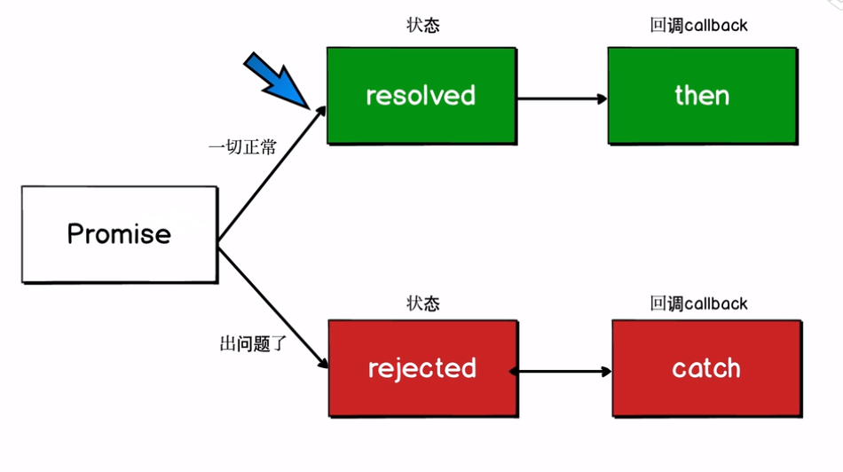

来源：[浪里行舟](https://github.com/ljianshu/Blog)

### <div align=center>ES6 核心特性

ES6 虽提供了许多新特性，但我们实际工作中用到频率较高并不多，根据二八法则，我们应该用百分之八十的精力和时间，好好专研这百分之二十核心特性，将会收到事半功倍的奇效！

<!--more-->


#### 开发环境配置

1. babel
   ES6 提供了许多新特性，但并不是所有的浏览器都能够完美支持。有些浏览器对于 ES6 并不是很友好，针对 ES6 的兼容性问题，很多团队为此开发出了多种语法解析转换工具(比如 babel，jsx，traceur 等)，可以把我们写的 ES6 语法转换成 ES5，相当于在 ES6 和浏览器之间做了一个翻译官。其中 Babel 是一个广泛使用的转码器，可以将 ES6 代码转为 ES5 代码，从而在现有环境执行。
   **如何配置 babel**
   ·首先要先安装 node.js，运行 npm init，然后会生成 package.json 文件
   ·npm install --save-dev babel-core babel-preset-es2015 babel-preset-latest
   ·创建并配置.babelrc 文件//存放在项目的根目录下，与 node_modules 同级
   ·npm install -g babel-cli
   ·babel-version
   Babel 的配置文件是.babelrc，存放在项目的根目录下。该文件用来设置转码规则和插件，具体内容如下：
   ```javascript
   //.babelrc文件
   {
       "presets": ["es2015", "latest"],
       "plugins": []
   }
   ```
2. webpack
   现今的很多网页其实可以看做是功能丰富的应用，它们拥有着复杂的 JavaScript 代码和一大堆依赖包，模快化工具就应运而生了，其中 webpack 功能强大深受人们喜爱。
   Webpack 的工作方式是：把你的项目当做一个整体，通过一个给定的主文件（如：index.js），Webpack 将从这个文件开始找到你的项目的所有依赖文件，使用 loaders 处理它们，最后打包为一个（或多个）浏览器可识别的 JavaScript 文件。

#### 块级作用域

ES5 只有全局作用域和函数作用域（例如，我们必须将代码包在函数内来限制作用域），这导致很多问题：
**情况 1：内层变量覆盖外层变量**

```javascript
var tmp = new Date();
function f() {
  console.log(tmp); //undefined
  if (false) {
    var tmp = 'hello world';
  }
}
```

**情况 2：变量泄露，成为全局变量**

```javascript
var s = 'hello';
for (var i = 0; i < s.length; i++) {
  console.log(s[i]);
}
console.log(i); // 5
```

ES6 提供 let 和 const 来代替 var 声明变量，新的声明方式支持用大括号表示的块级作用域，这会带来一些好处：

- 不再需要立即执行的函数表达式(IIFE)
  在 ES5 中，我们需要构造一个立即执行的函数表达式去保证我们不污染全局作用域。在 ES6 中， 我们可以使用更简单的大括号（{}），然后使用 const 或者 let 代替 var 来达到同样的效果。

- 循环体中的闭包不再有问题
  在 ES5 中，如果循环体内有产生一个闭包，访问闭包外的变量，会产生问题。在 ES6，你可以使用 “let” 来避免问题。

- 防止重复声明变量
  ES6 不允许在同一个作用域内用 let 或 const 重复声明同名变量。这对于防止在不同的 js 库中存在重复声明的函数表达式十分有帮助。

#### 数组的扩展

- Array.from() : 将伪数组对象或可遍历对象转换为真数组
  如果一个对象的所有键名都是正整数或零，并且有 length 属性，那么这个对象就很像数组，称为伪数组。典型的伪数组有函数的 arguments 对象，以及大多数 DOM 元素集，还有字符串。
  ```javascript
  Array.from(btns).forEach(item=>console.log(item))将伪数组转换为数组
  ```
- Array.of(v1, v2, v3) : 将一系列值转换成数组
  当调用 new Array( )构造器时，根据传入参数的类型与数量的不同，实际上会导致一些不同的结果。
  ES6 引入了 Array.of( )方法来解决这个问题。该方法的作用非常类似 Array 构造器，但在使用单个数值参数的时候并不会导致特殊结果。**Array.of( )方法总会创建一个包含所有传入参数的数组，而不管参数的数量与类型：**

  ```javascript
  let items = Array.of(1, 2);
  console.log(items.length); // 2
  console.log(items[0]); // 1
  console.log(items[1]); // 2
  items = Array.of(2);
  console.log(items.length); // 1
  console.log(items[0]); // 2
  ```

  Array.of 基本上可以用来替代 Array()或 newArray()，并且不存在由于参数不同而导致的重载，而且他们的行为非常统一。

- 数组实例的 find() 和 findIndex()

  数组实例的 find 方法，用于找出第一个符合条件的数组成员。它的参数是一个回调函数，所有数组成员依次执行该回调函数，直到找出**第一个**返回值为 true 的成员，然后返回该成员。如果没有符合条件的成员，则返回 undefined。
  数组实例的 findIndex 方法的用法与 find 方法非常类似，返回**第一个**符合条件的数组成员的位置，如果所有成员都不符合条件，则返回-1。

- 数组实例的 includes()
  Array.prototype.includes 方法返回一个布尔值，表示某个数组是否包含给定的值。该方法的第二个参数表示搜索的起始位置，默认为 0。如果第二个参数为负数，则表示倒数的位置，如果这时它大于数组长度（比如第二个参数为-4，但数组长度为 3），则会重置为从 0 开始。

- 数组实例的 entries()，keys() 和 values()
  ES6 提供 entries()，keys()和 values(),用于遍历数组。它们都返回一个遍历器对象，可以用 for...of 循环进行遍历，唯一的区别是 keys()是对键名的遍历、values()是对键值的遍历，entries()是对键值对的遍历。

  ```javascript
  for (let index of ['a', 'b'].keys()) {
    console.log(index);
  }
  // 0
  // 1

  for (let elem of ['a', 'b'].values()) {
    console.log(elem);
  }
  // 'a'
  // 'b'

  for (let [index, elem] of ['a', 'b'].entries()) {
    console.log(index, elem);
  }
  // 0 "a"
  // 1 "b"
  ```

#### 箭头函数

它主要有两个作用：缩减代码和改变 this 指向

1. 缩减代码
   ```javascript
   const double1 = function(number) {
     return number * 2; //ES5写法
   };
   const double2 = number => {
     return number * 2; //ES6写法
   };
   const double4 = number => number * 2; //可以进一步简化
   ```
2. 改变 this 指向
   长期以来，JavaScript 语言的 this 对象一直是一个令人头痛的问题，在对象方法中使用 this，必须非常小心。箭头函数”绑定”this，很大程度上解决了这个困扰。
   一个例子

   ```javascript
   const team = {
     members: ['Henry', 'Elyse'],
     teamName: 'es6',
     teamSummary: function() {
       return this.members.map(function(member) {
         return `${member}隶属于${this.teamName}小组`; // this不知道该指向谁了
       });
     },
   };
   console.log(team.teamSummary()); //["Henry隶属于undefined小组", "Elyse隶属于undefined小组"]
   ```

   如何修改：

   ```javascript
   //方法一
   const team = {
     members: ['Henry', 'Elyse'],
     teamName: 'es6',
     teamSummary: function() {
       let self = this;
       return this.members.map(function(member) {
         return `${member}隶属于${self.teamName}小组`;
       });
     },
   };
   console.log(team.teamSummary()); //["Henry隶属于es6小组", "Elyse隶属于es6小组"]

   //方法二、bind函数
   const team = {
     members: ['Henry', 'Elyse'],
     teamName: 'es6',
     teamSummary: function() {
       return this.members.map(
         function(member) {
           // this不知道该指向谁了
           return `${member}隶属于${this.teamName}小组`;
         }.bind(this)
       );
     },
   };
   console.log(team.teamSummary()); //["Henry隶属于es6小组", "Elyse隶属于es6小组"]

   //方法三、 箭头函数
   const team = {
     members: ['Henry', 'Elyse'],
     teamName: 'es6',
     teamSummary: function() {
       return this.members.map(member => {
         // this指向的就是team对象
         return `${member}隶属于${this.teamName}小组`;
       });
     },
   };
   console.log(team.teamSummary()); //["Henry隶属于es6小组", "Elyse隶属于es6小组"]
   ```

3. 使用注意点

   - 函数体内的 this 对象，就是定义时所在的对象，而不是使用时所在的对象。

   - 不可以当作构造函数，也就是说，不可以使用 new 命令，否则会抛出一个错误。

   - 不可以使用 arguments 对象，该对象在函数体内不存在。如果要用，可以用 rest 参数代替。

   - 不可以使用 yield 命令，因此箭头函数不能用作 Generator 函数。

#### rest 参数

ES6 引入 rest 参数（形式为...变量名），用于获取函数的多余参数，这样就不需要使用 arguments 对象了。
rest 参数搭配的变量是一个数组，该变量将多余的参数放入数组中。
传统写法：

```javascript
function addNumbers(a, b, c, d, e) {
  var numbers = [a, b, c, d, e];
  return numbers.reduce((sum, number) => {
    return sum + number;
  }, 0);
}
console.log(addNumbers(1, 2, 3, 4, 5)); //15
```

ES6 写法：

```javascript
function addNumbers(...numbers) {
  return numbers.reduce((sum, number) => {
    return sum + number;
  }, 0);
}
console.log(addNumbers(1, 2, 3, 4, 5)); //15
```

也可以与**解构赋值**组合使用

```javascript
var array = [1, 2, 3, 4, 5, 6];
var [a, b, ...c] = array;
console.log(a); //1
console.log(b); //2
console.log(c); //[3, 4, 5, 6]
```

**rest 参数还可以与箭头函数结合**

```javascript
const numbers = (...nums) => nums;
numbers(1, 2, 3, 4, 5); // [1,2,3,4,5]
```

#### 展开运算符

与剩余参数关联最密切的就是扩展运算符。剩余参数允许你把多个独立的参数合并到一个数组中；而扩展运算符则允许将一个数组分割，并将各个项作为分离的参数传给函数。

**当用在字符串或数组前面时称为扩展运算符,个人觉得可以理解为 rest 参数的逆运算，用于将数组或字符串进行拆解。**

```javascript
let value1 = 25;
let value2 = 50;
console.log(Math.max(value1, value2)); //50
```

但若想处理数组中的值，此时该如何找到最大值？Math.max()方法并不允许你传入一个数组。
用展开运算符：

```javascript
let values = [25, 50, 75, 100];
//等价于console.log(Math.max(25,50,75,100));
console.log(Math.max(...values)); //100

//与其他参数混用
let values = [-25, -50, -75, -100];
console.log(Math.max(...values, 0)); //0

//拆解字符串与数组
var array = [1, 2, 3, 4, 5];
console.log(...array); //1 2 3 4 5
var str = 'String';
console.log(...str); //S t r i n g

//实现拼接
var defaultColors = ["red","greed"];
var favoriteColors = ["orange","yellow"];
var fallColors = ["fire red","fall orange"];
console.log(["blue","green",...fallColors,...defaultColors,...favoriteColors]
//["blue", "green", "fire red", "fall orange", "red", "greed", "orange", "yellow"]
```

#### 解构赋值----更方便的数据访问

1. 解构为何有用
   在 ES5 及更早版本中，从对象或数组中获取信息、并将特定数据存入本地变量，需要书写许多并且相似的代码。例如：

   ```javascript
   var expense = {
     type: 'es6',
     amount: '45',
   };
   var type = expense.type;
   var amount = expense.amount;
   console.log(type, amount);
   ```

2. 对象
   上个例子中如果采用对象解构的方法，就很容易获取 expense 对象的 type 与 amount 值。

   ```javascript
   const { type, amount } = expense;
   console.log(type, amount);
   ```

   **默认值：**
   可以选择性地定义一个默认值，以便在指定属性不存在时使用该值。若要这么做，需要在 属性名后面添加一个等号并指定默认值

   ```javascript
   let node = {
     type: 'Identifier',
     name: 'foo',
   };
   let { type, name, value = true } = node;
   console.log(type); //	"Identifier"
   console.log(name); //	"foo"
   console.log(value); //	true
   ```

   **嵌套对象解构：**
   使用类似于对象字面量的语法，可以深入到嵌套的对象结构中去提取你想要的数据。

   ```javascript
   let node = {
     type: 'Identifier',
     name: 'foo',
     loc: {
       start: {
         line: 1,
         column: 1,
       },
       end: {
         line: 1,
         column: 4,
       },
     },
   };
   let {
     loc: { start },
   } = node;
   console.log(start.line); //	1
   console.log(start.column); //	1
   ```

3. 数组

   ```javascript
   const names = ['Henry', 'Bucky', 'Emily'];
   const [name1, name2, name3] = names;
   console.log(name1, name2, name3); //Henry Bucky Emily
   const [name, ...rest] = names; //结合展开运算符
   console.log(rest); //["Bucky", "Emily"]

   //用{}解构返回数组个数
   const { length } = names;
   console.log(length); //3

   //数组解构也可以用于赋值上下文，但不需要用小括号包裹表达式。
   let colors = ['red', 'green', 'blue'],
     firstColor = 'black',
     secondColor = 'purple';
   [firstColor, secondColor] = colors;
   console.log(firstColor); //"red"
   console.log(secondColor); // "green"

   //默认值
   let colors = ['red'];
   let [firstColor, secondColor = 'green'] = colors;
   console.log(firstColor); //	"red"
   console.log(secondColor); //	"green"
   ```

   **与 rest 参数搭配**
   在 ES5 中常常使用 concat()方法来克隆数组，例如：

   ```javascript
   var colors = ['red', 'green', 'blue'];
   var clonedColors = colors.concat();
   console.log(clonedColors); //"[red,green,blue]"

   //在ES6中克隆数组
   let colors = ['red', 'green', 'blue'];
   let [...clonedColors] = colors;
   console.log(clonedColors); //[red,green,blue]
   ```

   例子：如何将数组转化为对象

   ```javascript
   const points = [[4, 5], [10, 1], [0, 40]];
   //期望得到的数据格式如下，如何实现？
   // [
   //   {x:4,y:5},
   //   {x:10,y:1},
   //   {x:0,y:40}
   // ]
   let newPoints = points.map(pair => {
     const [x, y] = pair;
     return { x, y };
   });
   //还可以通过以下办法，更为简便
   let newPoints = points.map(([x, y]) => {
     return { x, y };
   });
   console.log(newPoints);
   ```

   **混合解构**

   ```javascript
   const people = [
     { name: 'Henry', age: 20 },
     { name: 'Bucky', age: 25 },
     { name: 'Emily', age: 30 },
   ];
   //es5 写法
   var age = people[0].age;
   console.log(age);
   //es6 解构
   const [age] = people;
   console.log(age); //第一次解构数组 {name:"Henry",age:20}
   const [{ age }] = people; //再一次解构对象
   console.log(age); //20
   ```

4. 注意点
   当使用解构来配合 var、let、const 来声明变量时，必须提供初始化程序（即等号右边的值）。
   ```javascript
   var { type, name }; // 语法错误！
   let { type, name }; // 语法错误！
   const { type, name }; // 语法错误！
   ```

#### 模板字符串（template string）

模板字符串是增强版的字符串，用反引号（`）标识。它可以当作普通字符串使用，也可以用来定义多行字符串，或者在字符串中嵌入变量。
模板字符串中嵌入变量和函数，需要将变量名写在\${}之中。

```javascript
let name = 'Henry';
function makeUppercase(word) {
  return word.toUpperCase();
}
let template = `
  <h1>${makeUppercase('Hello')}, ${name}!</h1>//可以存放函数和变量
  <p>感谢大家收看我们的视频, ES6为我们提供了很多遍历好用的方法和语法!</p>
  <ul>
    <li>1</li>
    <li>2</li>
    <li>3</li>
    <li>4</li>
    <li>5</li>
  </ul>
  `;
document.getElementById('template').innerHTML = template;
```

#### Class 和传统构造函数有何区别

从概念上讲，在 ES6 之前的 JS 中并没有和其他面向对象语言那样的“类”的概念。长时间里，人们把使用 new 关键字通过函数（也叫构造器）构造对象当做“类”来使用。由于 JS 不支持原生的类，而只是通过原型来模拟，各种模拟类的方式相对于传统的面向对象方式来说非常混乱，尤其是处理当子类继承父类、子类要调用父类的方法等等需求时。

ES6 提供了更接近传统语言的写法，引入了 Class（类）这个概念，作为对象的模板。通过 class 关键字，可以定义类。**但是类只是基于原型的面向对象模式的语法糖**。

对比在传统构造函数和 ES6 中分别如何实现类：

```javascript
//传统构造函数
function MathHandle(x,y){
  this.x=x;
  this.y=y;
}
MathHandle.prototype.add =function(){
  return this.x+this.y;
}；
var m=new MathHandle(1,2);
console.log(m.add());

//class语法
class MathHandle {
 constructor(x,y){
  this.x=x;
  this.y=y;
}
 add(){
   return this.x+this.y;
  }
}
const m = new MathHandle(1,2);
console.log(m.add());
```

对比在传统构造函数和 ES6 中分别如何实现继承：

```javascript
//传统构造函数继承
function Animal() {
  this.eat = function() {
    alert('Animal eat');
  };
}
function Dog() {
  this.bark = function() {
    alert('Dog bark');
  };
}
Dog.prototype = new Animal(); // 绑定原型，实现继承
var hashiqi = new Dog();
hashiqi.bark(); //Dog bark
hashiqi.eat(); //Animal eat

//ES6继承
class Animal {
  constructor(name) {
    this.name = name;
  }
  eat() {
    alert(this.name + ' eat');
  }
}
class Dog extends Animal {
  constructor(name) {
    super(name); // 有extend就必须要有super，它代表父类的构造函数，即Animal中的constructor
    this.name = name;
  }
  say() {
    alert(this.name + ' say');
  }
}
const dog = new Dog('哈士奇');
dog.say(); //哈士奇 say
dog.eat(); //哈士奇 eat
```

**Class 和传统构造函数有何区别**

- Class 在语法上更加贴合面向对象的写法
- Class 实现继承更加易读、易理解，对初学者更加友好
- 本质还是语法糖，使用 prototype

#### Promise 的基本使用和原理

在 JavaScript 的世界中，所有代码都是单线程执行的。由于这个“缺陷”，导致 JavaScript 的所有网络操作，浏览器事件，都必须是异步执行。
**Promise 是异步编程的一种解决方案，比传统的解决方案(回调函数和事件)更合理和更强大。**

**Promise 原理**

一旦状态改变，就不会再变，任何时候都可以得到这个结果。Promise 对象的状态改变，只有两种可能：从 pending 变为 fulfilled 和从 pending 变为 rejected。promise 对象初始化状态为 pending ；当调用 resolve(成功)，会由 pending => fulfilled ；当调用 reject(失败)，会由 pending => rejected。具体流程见下图：

Promise 的使用流程:

1. new Promise 一个实例，而且要 return
2. new Promise 时要传入函数，函数有 resolve reject 两个参数
3. 成功时执行 resolve，失败时执行 reject
4. then 监听结果

```javascript
function loadImg(src) {
  const promise = new Promise(function(resolve, reject) {
    var img = document.createElement('img');
    img.onload = function() {
      resolve(img);
    };
    img.onerror = function() {
      reject();
    };
    img.src = src;
  });
  return promise; //返回一个promise实例
}
var src = 'http://www.imooc.com/static/img/index/logo_new.png';
var result = loadImg(src);
result.then(
  function(img) {
    console.log(img.width); //resolved(成功)时候的回调函数
  },
  function() {
    console.log('failed'); //rejected(失败)时候的回调函数
  }
);
result.then(function(img) {
  console.log(img.height);
});
```

#### Iterator 和 for...of 循环

JavaScript 原有的表示“集合”的数据结构，主要是数组（Array）和对象（Object），ES6 又添加了 Map 和 Set。这样就需要一种统一的接口机制，来处理所有不同的数据结构。遍历器（Iterator）就是这样一种机制。它是一种接口，为各种不同的数据结构提供统一的访问机制。
**任何数据结构只要部署 Iterator 接口，就可以完成遍历操作（即依次处理该数据结构的所有成员）。**

1. Iterator 的作用：
   - 为各种数据结构，提供一个统一的、简便的访问接口；
   - 使得数据结构的成员能够按某种次序排列
   - ES6 创造了一种新的遍历命令 for...of 循环，Iterator 接口主要供 for...of 消费。
2. 原生具备 iterator 接口的数据(可用 for of 遍历)
   - Array
   - set 容器
   - map 容器
   - String
   - 函数的 arguments 对象
   - NodeList 对象
3. 几种遍历方式比较
   - for of 循环不仅支持数组、大多数伪数组对象，也支持字符串遍历，此外还支持 Map 和 Set 对象遍历。
   - for in 循环可以遍历字符串、对象、数组，不能遍历 Set/Map
   - forEach 循环不能遍历字符串、对象,可以遍历 Set/Map

#### ES6 模块化

ES6 在语言标准的层面上，实现了模块功能，而且实现得相当简单，旨在成为浏览器和服务器通用的模块解决方案。
**其模块功能主要由两个命令构成：export 和 import。export 命令用于规定模块的对外接口，import 命令用于输入其他模块提供的功能。**

```javascript
/** 定义模块 math.js **/
var basicNum = 0;
var add = function(a, b) {
  return a + b;
};
export { basicNum, add };
/** 引用模块 **/
import { basicNum, add } from './math';
function test(ele) {
  ele.textContent = add(99 + basicNum);
}
```

使用 import 命令的时候，用户需要知道所要加载的变量名或函数名，否则无法加载。
为了给用户提供方便，让他们不用阅读文档就能加载模块，就要用到 export default 命令，为模块指定默认输出。

```javascript
// export-default.js
export default function() {
  console.log('foo');
}
```

其他模块加载该模块时，import 命令可以为该匿名函数指定任意名字。

```javascript
// import-default.js
import customName from './export-default';
customName(); // 'foo'
```

**需要注意的是，这时 import 命令后面，不使用大括号。**
