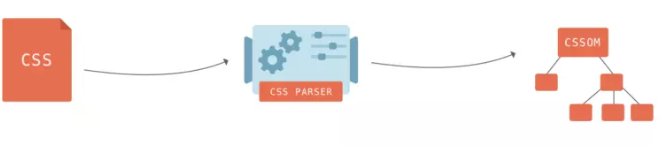
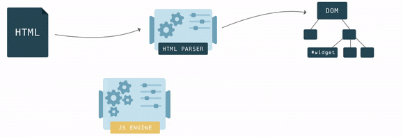
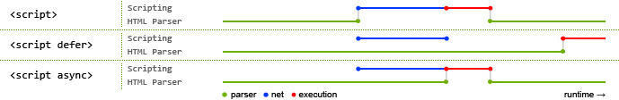
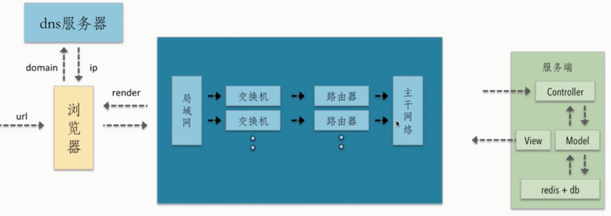

### 
浏览器渲染原理

---

目前市面上常见的浏览器内核可以分为这四种：Trident（IE）、Gecko（火狐）、Blink（Chrome、Opera）、Webkit（Safari）。

#### 页面加载过程

<!--more-->

- 浏览器根据 DNS 服务器得到域名的 IP 地址
- 向这个 IP 的机器发送 HTTP 请求
- 服务器收到、处理并返回 HTTP 请求
- 浏览器得到返回内容

#### 浏览器渲染过程

1. 处理 HTML 标记并构建 DOM 树。
2. 处理 CSS 标记并构建 CSSOM 树。
3. 将 DOM 与 CSSOM 合并成一个渲染树。
4. 根据渲染树来布局，以计算每个节点的几何信息。
5. 将各个节点绘制到屏幕上。

浏览器渲染过程大体分为如下三部分：

1. 浏览器会解析三个东西：

- 一是 HTML/SVG/XHTML，HTML 字符串描述了一个页面的结构，浏览器会把 HTML 结构字符串解析转换 DOM 树形结构。
  
- 二是 CSS，解析 CSS 会产生 CSS 规则树，它和 DOM 结构比较像。
  
- 三是 Javascript 脚本，等到 Javascript 脚本文件加载后， 通过 DOM API 和 CSSOM API 来操作 DOM Tree 和 CSS Rule Tree。
  

2. 解析完成后，浏览器引擎会通过 DOM Tree 和 CSS Rule Tree 来构造 Rendering Tree。

- Rendering Tree 渲染树并不等同于 DOM 树，渲染树只会包括需要显示的节点和这些节点的样式信息。
- CSS 的 Rule Tree 主要是为了完成匹配并把 CSS Rule 附加上 Rendering Tree 上的每个 Element（也就是每个 Frame）。
- 然后，计算每个 Frame 的位置，这又叫 layout 和 reflow 过程。

3. 最后通过调用操作系统 Native GUI 的 API 绘制。

#### 构建 DOM

浏览器会遵守一套步骤将 HTML 文件转换为 DOM 树。

#### 构建 CSSOM

DOM 会捕获页面的内容，但浏览器还需要知道页面如何展示，所以需要构建 CSSOM。

#### 构建渲染树

当我们生成 DOM 树和 CSSOM 树以后，就需要将这两棵树组合为渲染树。

渲染过程中，如果遇到\<script\>就停止渲染，执行 JS 代码。因为浏览器有 GUI 渲染线程与 JS 引擎线程，为了防止渲染出现不可预期的结果，这两个线程是互斥的关系。JavaScript 的加载、解析与执行会阻塞 DOM 的构建，也就是说，在构建 DOM 时，HTML 解析器若遇到了 JavaScript，那么它会暂停构建 DOM，将控制权移交给 JavaScript 引擎，等 JavaScript 引擎运行完毕，浏览器再从中断的地方恢复 DOM 构建。

也就是说，如果你想首屏渲染的越快，就越不应该在首屏就加载 JS 文件，这也是都建议将 script 标签放在 body 标签底部的原因。

**JS 文件不只是阻塞 DOM 的构建，它会导致 CSSOM 也阻塞 DOM 的构建。**

原本 DOM 和 CSSOM 的构建是互不影响，井水不犯河水，但是一旦引入了 JavaScript，CSSOM 也开始阻塞 DOM 的构建，只有 CSSOM 构建完毕后，DOM 再恢复 DOM 构建。

因为 JavaScript 不只是可以改 DOM，它还可以更改样式，也就是它可以更改 CSSOM。因为不完整的 CSSOM 是无法使用的，如果 JavaScript 想访问 CSSOM 并更改它，那么在执行 JavaScript 时，必须要能拿到完整的 CSSOM。所以就导致了一个现象，如果浏览器尚未完成 CSSOM 的下载和构建，而我们却想在此时运行脚本，那么浏览器将延迟脚本执行和 DOM 构建，直至其完成 CSSOM 的下载和构建。也就是说，**在这种情况下，浏览器会先下载和构建 CSSOM，然后再执行 JavaScript，最后在继续构建 DOM。**

#### 布局与绘制

当浏览器生成渲染树以后，就会根据渲染树来进行布局（也可以叫做回流）。这一阶段浏览器要做的事情是要弄清楚各个节点在页面中的确切位置和大小。通常这一行为也被称为“自动重排”。

布局流程的输出是一个“盒模型”，它会精确地捕获每个元素在视口内的确切位置和尺寸，所有相对测量值都将转换为屏幕上的绝对像素。

布局完成后，浏览器会立即发出“Paint Setup”和“Paint”事件，将渲染树转换成屏幕上的像素。

#### 补充说明

1. async 和 defer 的作用是什么？有什么区别?
   
   其中蓝色线代表 JavaScript 加载；红色线代表 JavaScript 执行；绿色线代表 HTML 解析。

2. 为什么操作 DOM 慢

   把 DOM 和 JavaScript 各自想象成一个岛屿，它们之间用收费桥梁连接。——《高性能 JavaScript》

   JS 是很快的，在 JS 中修改 DOM 对象也是很快的。在 JS 的世界里，一切是简单的、迅速的。但 DOM 操作并非 JS 一个人的独舞，而是两个模块之间的协作。

   因为 DOM 是属于渲染引擎中的东西，而 JS 又是 JS 引擎中的东西。当我们用 JS 去操作 DOM 时，本质上是 JS 引擎和渲染引擎之间进行了“跨界交流”。这个“跨界交流”的实现并不简单，它依赖了桥接接口作为“桥梁”

3. 回流和重绘

   重绘：当我们对 DOM 的修改导致了样式的变化、却并未影响其几何属性（比如修改了颜色或背景色）时，浏览器不需重新计算元素的几何属性、直接为该元素绘制新的样式（跳过了上图所示的回流环节）。

   回流：当我们对 DOM 的修改引发了 DOM 几何尺寸的变化（比如修改元素的宽、高或隐藏元素等）时，浏览器需要重新计算元素的几何属性（其他元素的几何属性和位置也会因此受到影响），然后再将计算的结果绘制出来。这个过程就是回流（也叫重排）
   **回流必定会发生重绘，重绘不一定会引发回流。**

   - 常见引起回流属性和方法
     任何会改变元素几何信息(元素的位置和尺寸大小)的操作，都会触发回流。
     - 添加或者删除可见的 DOM 元素；
     - 元素尺寸改变——边距、填充、边框、宽度和高度
     - 内容变化，比如用户在 input 框中输入文字
     - 浏览器窗口尺寸改变——resize 事件发生时
     - 计算 offsetWidth 和 offsetHeight 属性
     - 设置 style 属性的值

### 
浏览器存储

---

#### Cookie

1. Cookie 的来源
   Cookie 的本职工作并非本地存储，而是“维持状态”。
   因为 HTTP 协议是无状态的，HTTP 协议自身不对请求和响应之间的通信状态进行保存，通俗来说，服务器不知道用户上一次做了什么，这严重阻碍了交互式 Web 应用程序的实现。

   我们可以把 Cookie 理解为一个存储在浏览器里的一个小小的文本文件，它附着在 HTTP 请求上，在浏览器和服务器之间“飞来飞去”。它可以携带用户信息，当服务器检查 Cookie 的时候，便可以获取到客户端的状态。

2. 什么是 Cookie 及应用场景
   Cookie 指某些网站为了辨别用户身份而储存在用户本地终端上的数据(通常经过加密)。 cookie 是服务端生成，客户端进行维护和存储。通过 cookie,可以让服务器知道请求是来源哪个客户端，就可以进行客户端状态的维护，比如登陆后刷新，请求头就会携带登陆时 response header 中的 set-cookie,Web 服务器接到请求时也能读出 cookie 的值，根据 cookie 值的内容就可以判断和恢复一些用户的信息状态。

   典型的应用场景有：

   - 记住密码，下次自动登录。

   - 购物车功能。

   - 记录用户浏览数据，进行商品（广告）推荐。

3. Cookie 的原理及生成方式
   第一次访问网站的时候，浏览器发出请求，服务器响应请求后，会在响应头里面添加一个 Set-Cookie 选项，将 cookie 放入到响应请求中，在浏览器第二次发请求的时候，会通过 Cookie 请求头部将 Cookie 信息发送给服务器，服务端会辨别用户身份，另外，Cookie 的过期时间、域、路径、有效期、适用站点都可以根据需要来指定。

Cookie 的生成方式主要有两种：

- 生成方式一：http response header 中的 set-cookie
- 生成方式二：js 中可以通过 document.cookie 可以读写 cookie，以键值对的形式展示
  document.cookie='age=20;domain=.baidu.com'

4. Cookie 的缺陷
   - Cookie 不够大：Cookie 的大小限制在 4KB 左右，对于复杂的存储需求来说是不够用的。
     注意：各浏览器的 cookie 每一个 name=value 的 value 值大概在 4k，所以 4k 并不是一个域名下所有的 cookie 共享的,而是一个 name 的大小。
   - 过多的 Cookie 会带来巨大的性能浪费：Cookie 是紧跟域名的。同一个域名下的所有请求，都会携带 Cookie。
     cookie 是用来维护用户信息的，而域名(domain)下所有请求都会携带 cookie，但对于静态文件的请求，携带 cookie 信息根本没有用，此时可以通过 cdn（存储静态文件的）的域名和主站的域名分开来解决。
   - 由于在 HTTP 请求中的 Cookie 是明文传递的，所以安全性成问题，除非用 HTTPS。

#### localStorage

1. localStorage 的特点
   - 保存的数据长期存在，下一次访问该网站的时候，网页可以直接读取以前保存的数据。
   - 大小为 5M 左右
   - 仅在客户端使用，不和服务端进行通信
   - 接口封装较好
2. 存入/读取数据
   localStorage 保存的数据，以“键值对”的形式存在。也就是说，每一项数据都有一个键名和对应的值。所有的数据都是以文本格式保存。
   存入数据使用 setItem 方法。它接受两个参数，第一个是键名，第二个是保存的数据。
   localStorage.setItem("key","value");
   读取数据使用 getItem 方法。它只有一个参数，就是键名。
   var valueLocal = localStorage.getItem("key");

##### sessionStorage

sessionStorage 保存的数据用于浏览器的一次会话，当会话结束（通常是该窗口关闭），数据被清空；sessionStorage 特别的一点在于，即便是相同域名下的两个页面，只要它们不在同一个浏览器窗口中打开，那么它们的 sessionStorage 内容便无法共享；localStorage 在所有同源窗口中都是共享的；cookie 也是在所有同源窗口中都是共享的。除了保存期限的长短不同，SessionStorage 的属性和方法与 LocalStorage 完全一样。

1. sessionStorage 的特点
   - 会话级别的浏览器存储
   - 大小为 5M 左右
   - 仅在客户端使用，不和服务端进行通信
   - 接口封装较好
2. 使用场景
   sessionStorage 更适合用来存储生命周期和它同步的会话级别的信息。这些信息只适用于当前会话，当你开启新的会话时，它也需要相应的更新或释放。
3. sessionStorage 、localStorage 和 cookie 之间的区别

   - 共同点：都是保存在浏览器端，且都遵循同源策略。
   - 不同点：在于生命周期与作用域的不同。

作用域：localStorage 只要在相同的协议、相同的主机名、相同的端口下，就能读取/修改到同一份 localStorage 数据。sessionStorage 比 localStorage 更严苛一点，除了协议、主机名、端口外，还要求在同一窗口（也就是浏览器的标签页）下

生命周期：localStorage 是持久化的本地存储，存储在其中的数据是永远不会过期的，使其消失的唯一办法是手动删除；而 sessionStorage 是临时性的本地存储，它是会话级别的存储，当会话结束（页面被关闭）时，存储内容也随之被释放。

#### IndexedDB

IndexedDB 是一种低级 API，用于客户端存储大量结构化数据(包括文件和 blobs)。该 API 使用索引来实现对该数据的高性能搜索。IndexedDB 是一个运行在浏览器上的非关系型数据库。既然是数据库了，那就不是 5M、10M 这样小打小闹级别了。理论上来说，IndexedDB 是没有存储上限的（一般来说不会小于 250M）。它不仅可以存储字符串，还可以存储二进制数据。

1. IndexedDB 的特点
   - 键值对储存
     IndexedDB 内部采用对象仓库（object store）存放数据。所有类型的数据都可以直接存入，包括 JavaScript 对象。对象仓库中，数据以"键值对"的形式保存，每一个数据记录都有对应的主键，主键是独一无二的，不能有重复，否则会抛出一个错误。
   - 异步
     IndexedDB 操作时不会锁死浏览器，用户依然可以进行其他操作，这与 LocalStorage 形成对比，后者的操作是同步的。异步设计是为了防止大量数据的读写，拖慢网页的表现。
   - 支持事务
     IndexedDB 支持事务（transaction），这意味着一系列操作步骤之中，只要有一步失败，整个事务就都取消，数据库回滚到事务发生之前的状态，不存在只改写一部分数据的情况。
   - 同源限制
     IndexedDB 受到同源限制，每一个数据库对应创建它的域名。网页只能访问自身域名下的数据库，而不能访问跨域的数据库。
   - 储存空间大
     IndexedDB 的储存空间比 LocalStorage 大得多，一般来说不少于 250MB，甚至没有上限。
   - 支持二进制储存
     IndexedDB 不仅可以储存字符串，还可以储存二进制数据（ArrayBuffer 对象和 Blob 对象）。
2. IndexedDB 的常见操作
   在 IndexedDB 大部分操作并不是我们常用的调用方法，返回结果的模式，而是请求——响应的模式。

   - 建立打开 IndexedDB ----window.indexedDB.open("testDB")
     这条指令并不会返回一个 DB 对象的句柄，我们得到的是一个 IDBOpenDBRequest 对象，而我们希望得到的 DB 对象在其 result 属性中

     除了 result，IDBOpenDBRequest 接口定义了几个重要属性:

     onerror: 请求失败的回调函数句柄

     onsuccess:请求成功的回调函数句柄

     onupgradeneeded:请求数据库版本变化句柄

   - 关闭 IndexedDB----indexdb.close()
   - 删除 IndexedDB----window.indexedDB.deleteDatabase(indexdb)

### 
浏览器的缓存机制

---

缓存可以说是性能优化中简单高效的一种优化方式了。一个优秀的缓存策略可以缩短网页请求资源的距离，减少延迟，并且由于缓存文件可以重复利用，还可以减少带宽，降低网络负荷。

对于一个数据请求来说，可以分为发起网络请求、后端处理、浏览器响应三个步骤。浏览器缓存可以帮助我们在第一和第三步骤中优化性能。比如说直接使用缓存而不发起请求，或者发起了请求但后端存储的数据和前端一致，那么就没有必要再将数据回传回来，这样就减少了响应数据。

#### 缓存位置

从缓存位置上来说分为四种，并且各自有优先级，当依次查找缓存且都没有命中的时候，才会去请求网络。

- Service Worker
- Memory Cache
- Disk Cache
- Push Cache

1. **Service Worker**

Service Worker 是运行在浏览器背后的独立线程，一般可以用来实现缓存功能。使用 Service Worker 的话，传输协议必须为 HTTPS。因为 Service Worker 中涉及到请求拦截，所以必须使用 HTTPS 协议来保障安全。Service Worker 的缓存与浏览器其他内建的缓存机制不同，它可以让我们自由控制缓存哪些文件、如何匹配缓存、如何读取缓存，并且缓存是持续性的。

Service Worker 实现缓存功能一般分为三个步骤：首先需要先注册 Service Worker，然后监听到 install 事件以后就可以缓存需要的文件，那么在下次用户访问的时候就可以通过拦截请求的方式查询是否存在缓存，存在缓存的话就可以直接读取缓存文件，否则就去请求数据。

2. **Memory Cache**

Memory Cache 也就是内存中的缓存，主要包含的是当前中页面中已经抓取到的资源,例如页面上已经下载的样式、脚本、图片等。读取内存中的数据肯定比磁盘快,内存缓存虽然读取高效，可是缓存持续性很短，会随着进程的释放而释放。 一旦我们关闭 Tab 页面，内存中的缓存也就被释放了。

3. **Disk Cache**

Disk Cache 也就是存储在硬盘中的缓存，读取速度慢点，但是什么都能存储到磁盘中，比之 Memory Cache 胜在容量和存储时效性上。

4. **Push Cache**

Push Cache（推送缓存）是 HTTP/2 中的内容，当以上三种缓存都没有命中时，它才会被使用。它只在会话（Session）中存在，一旦会话结束就被释放，并且缓存时间也很短暂，在 Chrome 浏览器中只有 5 分钟左右，同时它也并非严格执行 HTTP 头中的缓存指令。

#### 缓存过程分析

浏览器与服务器通信的方式为应答模式，即是：浏览器发起 HTTP 请求 – 服务器响应该请求。浏览器第一次向服务器发起该请求后拿到请求结果后，将请求结果和缓存标识存入浏览器缓存，浏览器对于缓存的处理是根据第一次请求资源时返回的响应头来确定的。具体过程如下图：

#### 强缓存

强缓存：不会向服务器发送请求，直接从缓存中读取资源，在 chrome 控制台的 Network 选项中可以看到该请求返回 200 的状态码，并且 Size 显示 from disk cache 或 from memory cache。强缓存可以通过设置两种 HTTP Header 实现：Expires 和 Cache-Control。

1. Expires
   缓存过期时间，用来指定资源到期的时间，是服务器端的具体的时间点。也就是说，Expires=max-age + 请求时间，需要和 Last-modified 结合使用。Expires 是 Web 服务器响应消息头字段，在响应 http 请求时告诉浏览器在过期时间前浏览器可以直接从浏览器缓存取数据，而无需再次请求。
2. Cache-Control
   在 HTTP/1.1 中，Cache-Control 是最重要的规则，主要用于控制网页缓存。比如当 Cache-Control:max-age=300 时，则代表在这个请求正确返回时间（浏览器也会记录下来）的 5 分钟内再次加载资源，就会命中强缓存。

### 
从 URL 输入到页面展现到底发生什么？

总体来说分为以下几个过程:

- DNS 解析:将域名解析成 IP 地址
- TCP 连接：TCP 三次握手
- 发送 HTTP 请求
- 服务器处理请求并返回 HTTP 报文
- 浏览器解析渲染页面
- 断开连接：TCP 四次挥手

#### URL 到底是啥

URL（Uniform Resource Locator），统一资源定位符，用于定位互联网上资源，俗称网址。

scheme://host.domain:port/path/filename

scheme - 定义因特网服务的类型。常见的协议有 http、https、ftp、file，其中最常见的类型是 http，而 https 则是进行加密的网络传输。
host - 定义域主机（http 的默认主机是 www）
domain - 定义因特网域名，比如 w3school.com.cn
port - 定义主机上的端口号（http 的默认端口号是 80）
path - 定义服务器上的路径（如果省略，则文档必须位于网站的根目录中）。
filename - 定义文档/资源的名称

#### 域名解析（DNS）

在浏览器输入网址后，首先要经过域名解析，因为浏览器并不能直接通过域名找到对应的服务器，而是要通过 IP 地址。

1. IP 地址
   IP 地址是指互联网协议地址，是 IP Address 的缩写。IP 地址是 IP 协议提供的一种统一的地址格式，它为互联网上的每一个网络和每一台主机分配一个逻辑地址，以此来屏蔽物理地址的差异。IP 地址是一个 32 位的二进制数，比如 127.0.0.1 为本机 IP。
2. 什么是域名解析
   DNS 协议提供通过域名查找 IP 地址，或逆向从 IP 地址反查域名的服务。DNS 是一个网络服务器，我们的域名解析简单来说就是在 DNS 上记录一条信息记录。
3. 浏览器如何通过域名去查询 URL 对应的 IP 呢
   - 浏览器缓存：浏览器会按照一定的频率缓存 DNS 记录。
   - 操作系统缓存：如果浏览器缓存中找不到需要的 DNS 记录，那就去操作系统中找。
   - 路由缓存：路由器也有 DNS 缓存。
   - ISP 的 DNS 服务器：ISP 是互联网服务提供商(Internet Service Provider)的简称，ISP 有专门的 DNS 服务器应对 DNS 查询请求。
   - 根服务器：ISP 的 DNS 服务器还找不到的话，它就会向根服务器发出请求，进行递归查询（DNS 服务器先问根域名服务器.com 域名服务器的 IP 地址，然后再问.baidu 域名服务器，依次类推）
4. 小结
   浏览器通过向 DNS 服务器发送域名，DNS 服务器查询到与域名相对应的 IP 地址，然后返回给浏览器，浏览器再将 IP 地址打在协议上，同时请求参数也会在协议搭载，然后一并发送给对应的服务器。

#### TCP 三次握手

在客户端发送数据之前会发起 TCP 三次握手用以同步客户端和服务端的序列号和确认号，并交换 TCP 窗口大小信息。

1. TCP 三次握手的过程如下

   - 客户端发送一个带 SYN=1，Seq=X 的数据包到服务器端口（第一次握手，由浏览器发起，告诉服务器我要发送请求了）

   - 服务器发回一个带 SYN=1， ACK=X+1， Seq=Y 的响应包以示传达确认信息（第二次握手，由服务器发起，告诉浏览器我准备接受了，你赶紧发送吧）

   - 客户端再回传一个带 ACK=Y+1， Seq=Z 的数据包，代表“握手结束”（第三次握手，由浏览器发送，告诉服务器，我马上就发了，准备接受吧）

2. 为啥需要三次握手
   谢希仁著《计算机网络》中讲“三次握手”的目的是“**为了防止已失效的连接请求报文段突然又传送到了服务端，因而产生错误**”。

#### 发送 HTTP 请求

请求报文由请求行（request line）、请求头（header）、请求体三个部分组成,

1. 请求行包含请求方法、URL、协议版本
   - 请求方法包含 8 种：GET、POST、PUT、DELETE、PATCH、HEAD、OPTIONS、TRACE。
   - URL 即请求地址，由 <协议>：//<主机>：<端口>/<路径>?<参数> 组成
   - 协议版本即 http 版本号
2. 请求头包含请求的附加信息，由关键字/值对组成，每行一对，关键字和值用英文冒号“:”分隔。
   请求头部通知服务器有关于客户端请求的信息。它包含许多有关的客户端环境和请求正文的有用信息。其中比如：Host，表示主机名，虚拟主机；Connection,HTTP/1.1 增加的，使用 keepalive，即持久连接，一个连接可以发多个请求；User-Agent，请求发出者，兼容性以及定制化需求。
3. 请求体，可以承载多个请求参数的数据，包含回车符、换行符和请求数据，并不是所有请求都具有请求数据。
   name=tom&password=1234&realName=tomson

#### 服务器处理请求并返回 HTTP 报文

服务器是网络环境中的高性能计算机，它侦听网络上的其他计算机（客户机）提交的服务请求，并提供相应的服务，比如网页服务、文件下载服务、邮件服务、视频服务。而客户端主要的功能是浏览网页、看视频、听音乐等等，两者截然不同。 每台服务器上都会安装处理请求的应用——web server。常见的 web server 产品有 apache、nginx、IIS 或 Lighttpd 等。

#### 浏览器解析渲染页面

- 根据 HTML 解析出 DOM 树
- 根据 CSS 解析生成 CSS 规则树
- 结合 DOM 树和 CSS 规则树，生成渲染树
- 根据渲染树计算每一个节点的信息
- 根据计算好的信息绘制页面

#### 断开连接

- 发起方向被动方发送报文，Fin、Ack、Seq，表示已经没有数据传输了。并进入 FIN_WAIT_1 状态。(第一次挥手：由浏览器发起的，发送给服务器，我请求报文发送完了，你准备关闭吧)
- 被动方发送报文，Ack、Seq，表示同意关闭请求。此时主机发起方进入 FIN_WAIT_2 状态。(第二次挥手：由服务器发起的，告诉浏览器，我请求报文接受完了，我准备关闭了，你也准备吧)
- 被动方向发起方发送报文段，Fin、Ack、Seq，请求关闭连接。并进入 LAST_ACK 状态。(第三次挥手：由服务器发起，告诉浏览器，我响应报文发送完了，你准备关闭吧)
- 发起方向被动方发送报文段，Ack、Seq。然后进入等待 TIME_WAIT 状态。被动方收到发起方的报文段以后关闭连接。发起方等待一定时间未收到回复，则正常关闭。(第四次挥手：由浏览器发起，告诉服务器，我响应报文接受完了，我准备关闭了，你也准备吧)
